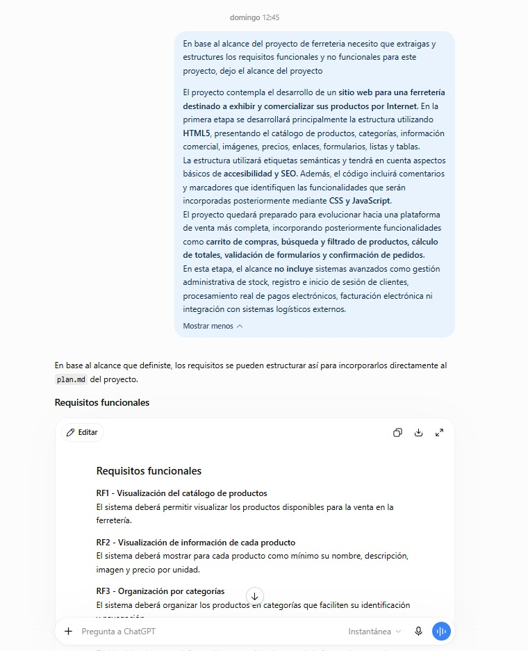
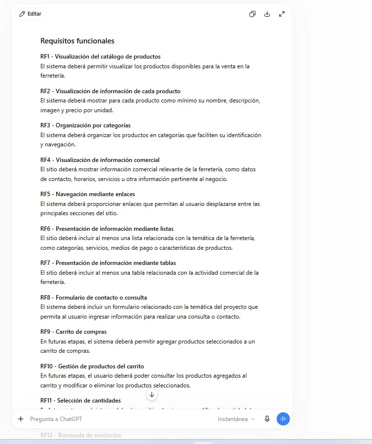
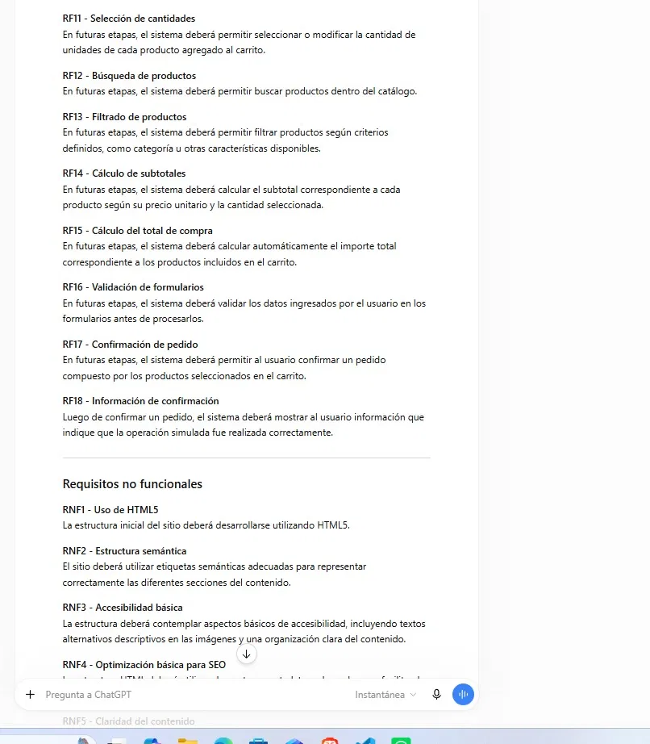
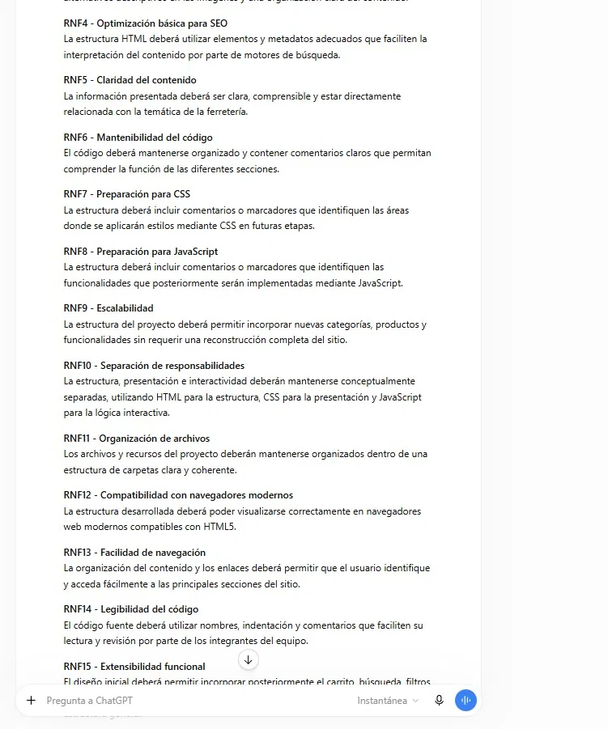
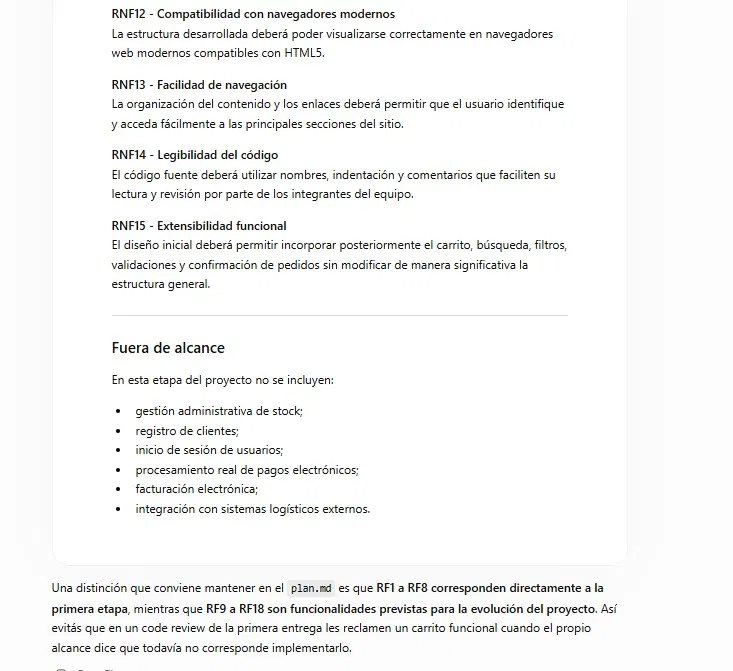

# Prompt 1

**Integrante:** Angel Cuarteron
**Rol:** Coordinador / DevOps
**Modelo de IA:** ChatGPT (OpenAI)
**Método de prompt:** Zero-shot prompting

## Prompt exacto
```
En base al alcance del proyecto de ferretería necesito que extraigas y estructures los requisitos funcionales y no funcionales para este proyecto, dejo el alcance del proyecto:

El proyecto contempla el desarrollo de un sitio web para una ferretería destinado a exhibir y comercializar sus productos por Internet. En la primera etapa se desarrollará principalmente la estructura utilizando HTML5, presentando el catálogo de productos, categorías, información comercial, imágenes, precios, enlaces, formularios, listas y tablas.
La estructura utilizará etiquetas semánticas y tendrá en cuenta aspectos básicos de accesibilidad y SEO. Además, el código incluirá comentarios y marcadores que identifiquen las funcionalidades que serán incorporadas posteriormente mediante CSS y JavaScript.
El proyecto quedará preparado para evolucionar hacia una plataforma de venta más completa, incorporando posteriormente funcionalidades como carrito de compras, búsqueda y filtrado de productos, cálculo de totales, validación de formularios y confirmación de pedidos.
``` 

**Captura de pantalla del prompt solicitado:**


## Resultado esperado

Obtener el alcance del proyecto redactado de forma clara, junto con el listado de Requisitos Funcionales (RF) y No Funcionales (RNF) estructurados y numerados, distinguiendo qué corresponde a esta primera entrega y qué queda fuera de alcance por ahora, para incluir en `plan.md`.

## Resultado obtenido

ChatGPT devolvió un listado estructurado de 18 Requisitos Funcionales (RF1 a RF18) y 15 Requisitos No Funcionales (RNF1 a RNF15), aclarando que RF1-RF8 corresponden directamente a esta primera etapa (catálogo, categorías, navegación, formulario de contacto) mientras que RF9-RF18 son funcionalidades previstas para la evolución del proyecto (carrito, búsqueda, filtros, validaciones, confirmación de pedidos). Agregó además una sección explícita de "Fuera de alcance" para esta etapa, listando gestión de stock, registro de clientes, login, pagos electrónicos reales, facturación electrónica e integración logística.

**Captura de pantalla del resultado obtenido:**





## Correcciones manuales realizadas

- Se ajustó manualmente la redacción del alcance del proyecto varias veces hasta llegar a una versión conforme, antes de incorporarlo a `plan.md`.

## Aplicación en el proyecto

`plan.md` — sección de Requisitos Funcionales (RF1 a RF18) y Requisitos No Funcionales (RNF1 a RNF15).  
Estos requisitos formaron la base inicial del plan.md, distinguiendo lo que se implementa en la Actividad Obligatoria N°1 de lo que queda para entregas futuras.