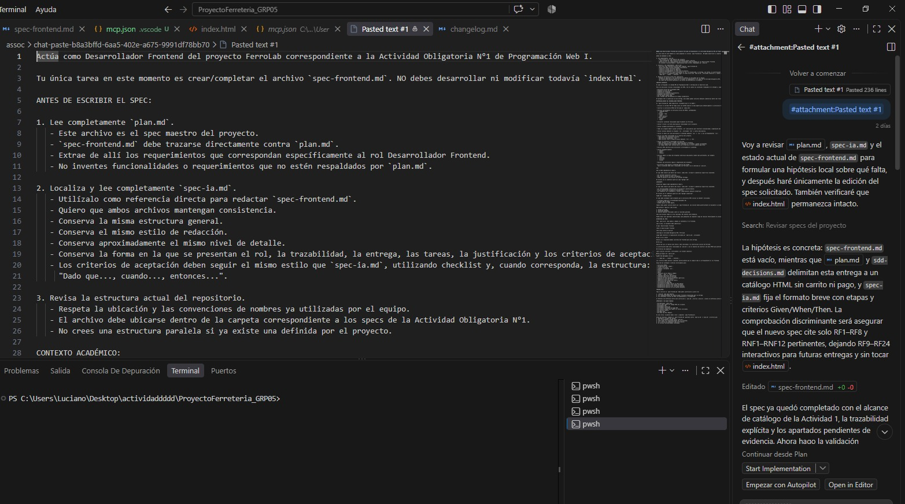
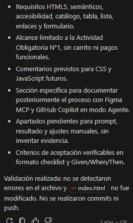

# Prompt 2

**Integrante:** Luciano Barrionuevo
**Rol:** Desarrollador Frontend
**Modelo de IA:** GitHub Copilot Chat (modo Agente)
**Método de prompt:** Role prompting

## Prompt exacto
```
Actúa como Desarrollador Frontend del proyecto FerroLab correspondiente a la Actividad Obligatoria N°1 de Programación Web I.

Tu única tarea en este momento es crear/completar el archivo `spec-frontend.md`. NO debes desarrollar ni modificar todavía `index.html`.

ANTES DE ESCRIBIR EL SPEC:

1. Lee completamente `plan.md`.
   - Este archivo es el spec maestro del proyecto.
   - `spec-frontend.md` debe trazarse directamente contra `plan.md`.
   - Extrae de allí los requerimientos que correspondan específicamente al rol Desarrollador Frontend.
   - No inventes funcionalidades o requerimientos que no estén respaldados por `plan.md`.

2. Localiza y lee completamente `spec-ia.md`.
   - Utilízalo como referencia directa para redactar `spec-frontend.md`.
   - Quiero que ambos archivos mantengan consistencia.
   - Conserva la misma estructura general.
   - Conserva el mismo estilo de redacción.
   - Conserva aproximadamente el mismo nivel de detalle.
   - Conserva la forma en la que se presentan el rol, la trazabilidad, la entrega, las tareas, la justificación y los criterios de aceptación.
   - Los criterios de aceptación deben seguir el mismo estilo que `spec-ia.md`, utilizando checklist y, cuando corresponda, la estructura:
     "Dado que..., cuando..., entonces...".

3. Revisa la estructura actual del repositorio.
   - Respeta la ubicación y las convenciones de nombres ya utilizadas por el equipo.
   - El archivo debe ubicarse dentro de la carpeta correspondiente a los specs de la Actividad Obligatoria N°1.
   - No crees una estructura paralela si ya existe una definida por el proyecto.

CONTEXTO ACADÉMICO:

El spec corresponde a la Unidad N°1 de Programación Web I: Introducción al desarrollo web.

Para las decisiones técnicas relacionadas con HTML, ten en cuenta los contenidos trabajados en la Unidad 1, especialmente:

- Estructura básica de un documento HTML.
- Elementos básicos de HTML.
- Elementos de contenido.
- Formularios y elementos de formulario.
- Etiquetas semánticas de HTML5.
- Uso de Visual Studio Code.
- Git y GitHub como herramientas de trabajo colaborativo.

No agregues CSS ni JavaScript en esta entrega. Solo deben quedar previstos mediante comentarios dentro del futuro HTML, ya que serán incorporados posteriormente.

RESPONSABILIDADES DEL DESARROLLADOR FRONTEND:

El `spec-frontend.md` debe especificar claramente que el rol deberá:

- Utilizar el servidor MCP de Figma junto con GitHub Copilot en modo Agente para obtener/generar la estructura HTML inicial tomando como referencia el mockup realizado por el Documentador/Diseñador UX.

- Construir la estructura HTML5 de FerroLab en `index.html`.

- Utilizar correctamente la estructura básica de HTML5, contemplando:
  - `<!DOCTYPE html>`
  - `<html>`
  - atributo `lang`
  - `<head>`
  - `<meta charset>`
  - meta viewport
  - `<title>`
  - `<body>`

- Incorporar contenido relacionado específicamente con FerroLab.

- Incluir títulos y párrafos descriptivos relacionados con el proyecto.

- Incluir imágenes pertinentes al contenido.

- Todas las imágenes deberán poseer atributos `alt` descriptivos para favorecer accesibilidad y comprensión del contenido.

- Incluir enlaces mediante la etiqueta `<a>`, utilizando `href` y textos descriptivos.

- Incluir al menos una lista pertinente al contenido mediante `<ul>` o `<ol>` y sus correspondientes `<li>`.

- Incluir una tabla relacionada con la temática del proyecto.
  - Debe poseer una estructura correcta.
  - Debe utilizar encabezados `<th>`.
  - Debe utilizar filas y celdas de datos mediante `<tr>` y `<td>`.

- Incluir un formulario relacionado con FerroLab.
  - Debe contener al menos 3 campos relevantes para el proyecto.
  - Utilizar elementos de formulario HTML trabajados en la Unidad 1 cuando correspondan.
  - Los campos deben tener sentido dentro de la temática y no ser ejemplos genéricos.

- Utilizar HTML semántico para estructurar correctamente el contenido.

- Incluir obligatoriamente:
  - `<header>`
  - `<main>`
  - `<footer>`

- Utilizar además al menos dos etiquetas semánticas adicionales cuando sean pertinentes, por ejemplo:
  - `<nav>`
  - `<section>`
  - `<article>`
  - `<aside>`

- Mantener una estructura lógica y comprensible del documento.

- No utilizar Lorem Ipsum ni contenido genérico de prueba.
  Todo el contenido debe estar relacionado con FerroLab y con lo definido en `plan.md`.

CSS:

CSS no debe implementarse todavía.

El spec debe indicar que dentro del futuro `index.html` se dejarán comentarios específicos señalando:

- qué sectores necesitarán estilos;
- qué tipo de estilos se prevé incorporar;
- dónde se aplicarán esos estilos en próximas entregas.

No alcanza con un comentario genérico como "agregar CSS".

JAVASCRIPT:

JavaScript tampoco debe implementarse todavía.

El spec debe indicar que dentro del futuro `index.html` se dejarán comentarios específicos señalando:

- qué funcionalidades interactivas se incorporarán posteriormente;
- en qué sectores de la página se incorporarán;
- qué elementos serán candidatos a recibir comportamiento mediante JavaScript.

No alcanza con un comentario genérico como "agregar JavaScript".

FIGMA MCP + GITHUB COPILOT:

El spec debe contemplar explícitamente que la estructura HTML inicial se obtendrá utilizando:

- el mockup creado por el Documentador/Diseñador UX;
- servidor MCP de Figma;
- GitHub Copilot en modo Agente.

También debe quedar prevista dentro de `spec-frontend.md` una sección donde posteriormente se documente la evidencia real del proceso.

Debe permitir registrar como mínimo:

1. Prompt utilizado.
2. Resultado obtenido.
3. Ajustes manuales realizados sobre el resultado generado.

Como este proceso todavía no fue realizado, NO inventes esta evidencia.

Puedes dejar esos apartados identificados como pendientes de completar luego de realizar efectivamente el proceso con Figma MCP.

ESTRUCTURA DEL SPEC:

Toma `spec-ia.md` como modelo y adapta su contenido al rol Frontend.

Como mínimo, el documento debe identificar:

# Spec: Desarrollador Frontend

**Rol:** Desarrollador Frontend

**Se traza contra:** plan.md

**Entrega:** Actividad Obligatoria N°1 — FerroLab

Luego debe conservar la organización utilizada por `spec-ia.md`, incluyendo:

## Qué se va a hacer

Detalla las responsabilidades concretas del Frontend para esta entrega.

## Por qué

Explica por qué se realiza esta tarea y cómo contribuye a la construcción inicial de FerroLab.

La justificación debe estar relacionada con `plan.md` y con el objetivo de construir una base HTML5 que posteriormente pueda evolucionar con CSS y JavaScript.

## Criterios de aceptación

Crea criterios concretos, verificables y en formato checklist.

Mantén el estilo de `spec-ia.md`.

Cuando sea apropiado utiliza:

- [ ] Dado que..., cuando..., entonces...

Los criterios deben permitir comprobar posteriormente que se cumplió todo lo correspondiente al rol Frontend.

Asegúrate de contemplar criterios verificables para:

- estructura HTML5;
- configuración del `<head>`;
- títulos y párrafos;
- imágenes y atributos `alt`;
- enlaces;
- listas;
- tabla;
- formulario con al menos 3 campos;
- `header`, `main` y `footer`;
- etiquetas semánticas adicionales;
- contenido específico de FerroLab;
- ausencia de Lorem Ipsum/placeholders genéricos;
- comentarios para CSS futuro;
- comentarios para JavaScript futuro;
- utilización del mockup;
- utilización de Figma MCP;
- utilización de GitHub Copilot en modo Agente;
- documentación posterior del prompt utilizado;
- documentación posterior del resultado obtenido;
- documentación posterior de los ajustes manuales.

TRAZABILIDAD:

Todo lo escrito en `spec-frontend.md` debe poder justificarse a partir de:

1. `plan.md` como spec maestro.
2. Las responsabilidades del Desarrollador Frontend establecidas para la entrega.
3. Los contenidos técnicos de HTML correspondientes a la Unidad N°1.

Si detectas una diferencia entre esta instrucción y `plan.md`, prioriza `plan.md` y señala la diferencia antes de agregar algo que no esté contemplado.

IMPORTANTE — NO HACER TODAVÍA:

- NO modifiques `index.html`.
- NO escribas todavía el código HTML de la página.
- NO agregues CSS.
- NO agregues JavaScript.
- NO inventes resultados de Figma MCP.
- NO inventes prompts que todavía no fueron utilizados.
- NO realices commits.
- NO hagas push.
- NO crees una Pull Request.

En esta tarea únicamente debes crear o completar `spec-frontend.md`.

Antes de finalizar, compara el `spec-frontend.md` generado contra `spec-ia.md` y `plan.md` y verifica que:
1. mantenga el formato del equipo;
2. esté correctamente trazado contra `plan.md`;
3. cubra todas las responsabilidades del rol Frontend;
4. sus criterios de aceptación sean verificables;
5. no incluya funcionalidades inventadas.
```


**Captura de pantalla del prompt solicitado:**


## Resultado esperado

Generar el archivo `spec-frontend.md` con la misma estructura y estilo que `spec-ia.md`, trazado contra `plan.md`, cubriendo las responsabilidades del Desarrollador Frontend para esta entrega (estructura HTML5, contenido de FerroLab, formulario, tabla, listas, etiquetas semánticas), sin tocar `index.html` ni inventar evidencia de Figma MCP que todavía no se había generado.

## Resultado obtenido

El agente completó `spec-frontend.md` trazado contra `plan.md` (RF1-RF8 y RNF1-RNF12), manteniendo la estructura de `spec-ia.md`. Incluyó las responsabilidades del rol Frontend, los requisitos de HTML5 semántico, accesibilidad, catálogo, tabla, lista, enlaces y formulario, con el alcance limitado a esta entrega (sin carrito ni pagos funcionales). Dejó comentarios previstos para CSS y JavaScript futuros, una sección específica para documentar después el proceso con Figma MCP y GitHub Copilot, y los apartados de prompt/resultado/ajustes manuales pendientes sin inventar evidencia. Validó que `index.html` no fue modificado y confirmó que no se realizaron commits ni push.

**Captura de pantalla del resultado obtenido:**



## Correcciones manuales realizadas

- No se realizaron correcciones manuales.

## Aplicación en el proyecto

`docs/03-specs/actividad-obligatoria-1/spec-frontend.md`