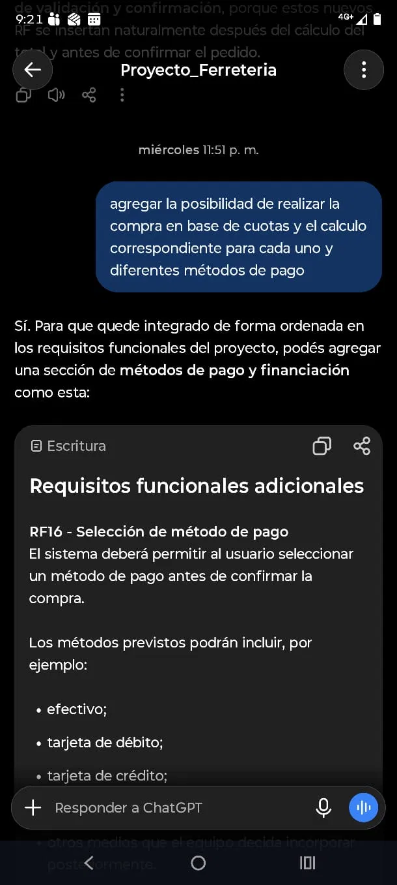
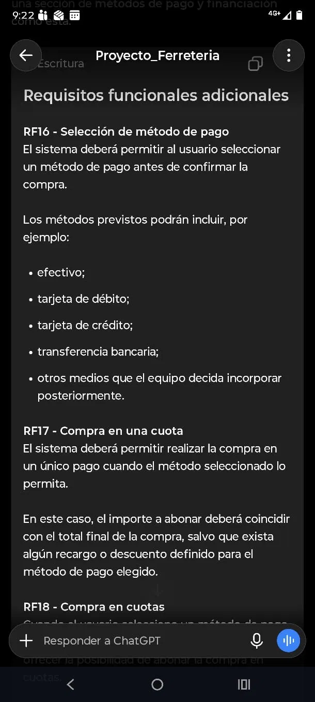
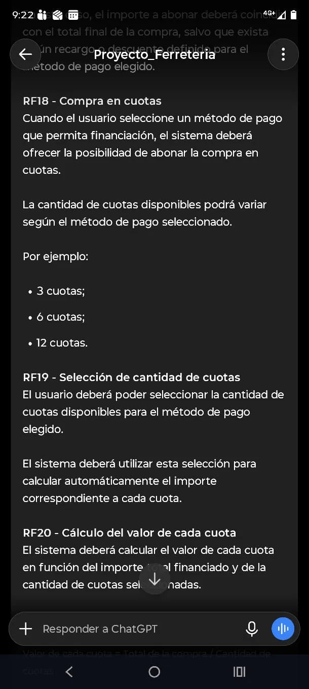
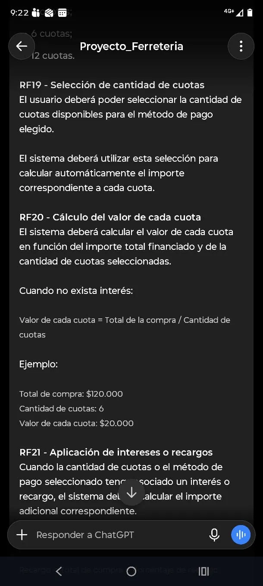
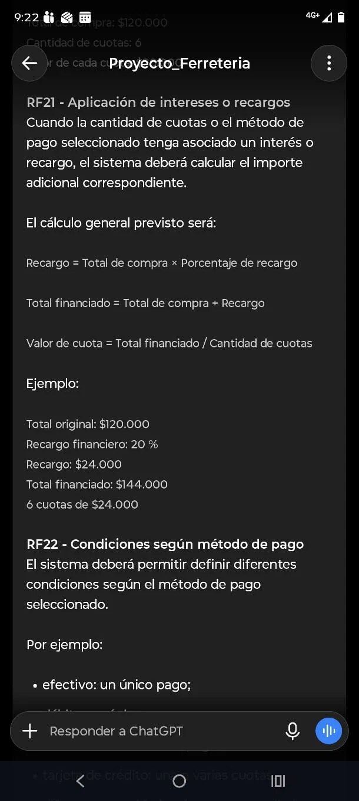
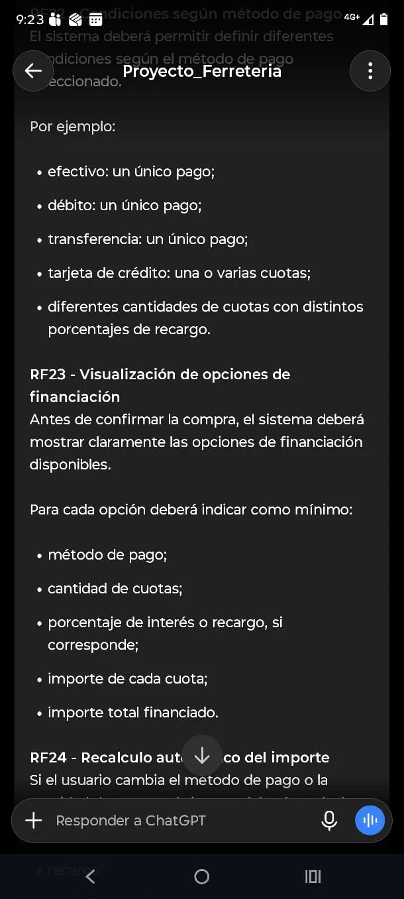
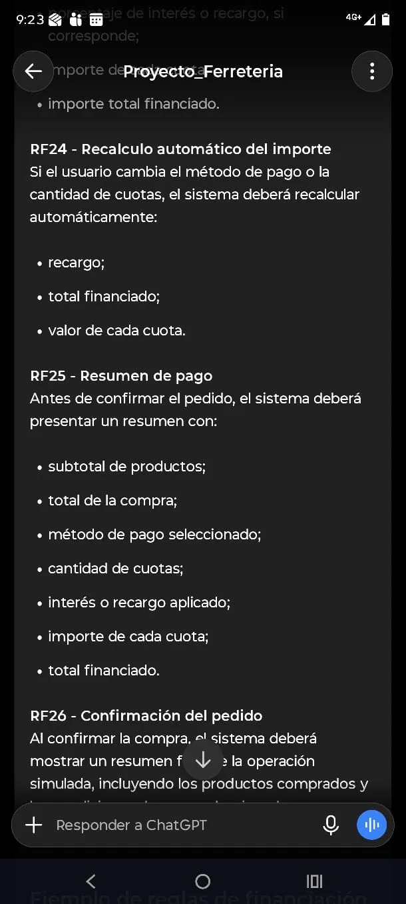
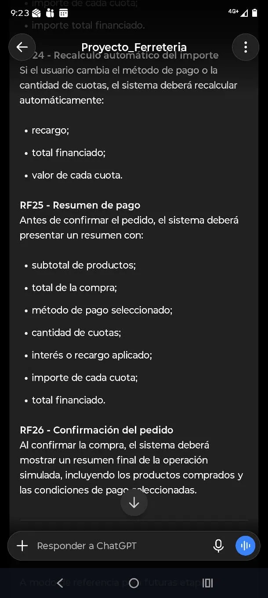

# Prompt 3

**Integrante:** Angel Cuarteron
**Rol:** Coordinador / DevOps
**Modelo de IA:** ChatGPT (OpenAI)
**Método de prompt:** Zero-shot prompting

## Prompt exacto
``` 
agregar la posibilidad de realizar la compra en base de cuotas y el calculo correspondiente para cada uno y diferentes métodos de pago
```

**Captura de pantalla del prompt solicitado:**


## Resultado esperado

Agregar al `plan.md` los diferentes métodos de pago disponibles, la posibilidad de comprar en un solo pago o en cuotas, y el detalle de cómo se calcula cada cuota, incluyendo intereses o recargos según el método elegido.

## Resultado obtenido

ChatGPT devolvió un listado detallado de Requisitos Funcionales (RF16 a RF26) cubriendo: selección de método de pago (RF16), compra en un pago (RF17), compra en cuotas (RF18), selección de cantidad de cuotas (RF19), cálculo del valor de cada cuota con y sin interés (RF20), aplicación de intereses o recargos con fórmulas concretas (RF21), condiciones específicas según método de pago (RF22), visualización de opciones de financiación (RF23), recálculo automático ante cambios (RF24), resumen de pago antes de confirmar (RF25) y confirmación del pedido (RF26). Incluyó fórmulas explícitas (Recargo = Total de compra × Porcentaje de recargo; Total financiado = Total de compra + Recargo; Valor de cuota = Total financiado / Cantidad de cuotas) acompañadas de ejemplos numéricos concretos (ej: compra de $120.000 con 20% de recargo → $144.000 financiados en 6 cuotas de $24.000).

**Captura de pantalla del resultado obtenido:**









## Correcciones manuales realizadas

- Se integraron los nuevos RF (16 a 26) al listado ya existente en `plan.md`, ajustando la numeración para que no se superpusiera con los requisitos ya definidos previamente.

## Aplicación en el proyecto

`plan.md` — sección de Requisitos Funcionales, incorporando el detalle completo de métodos de pago, cuotas y cálculo de financiación.