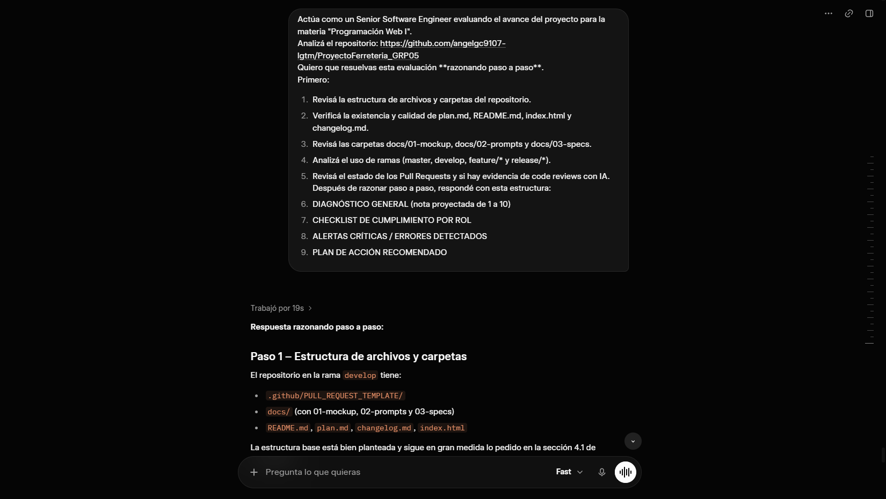
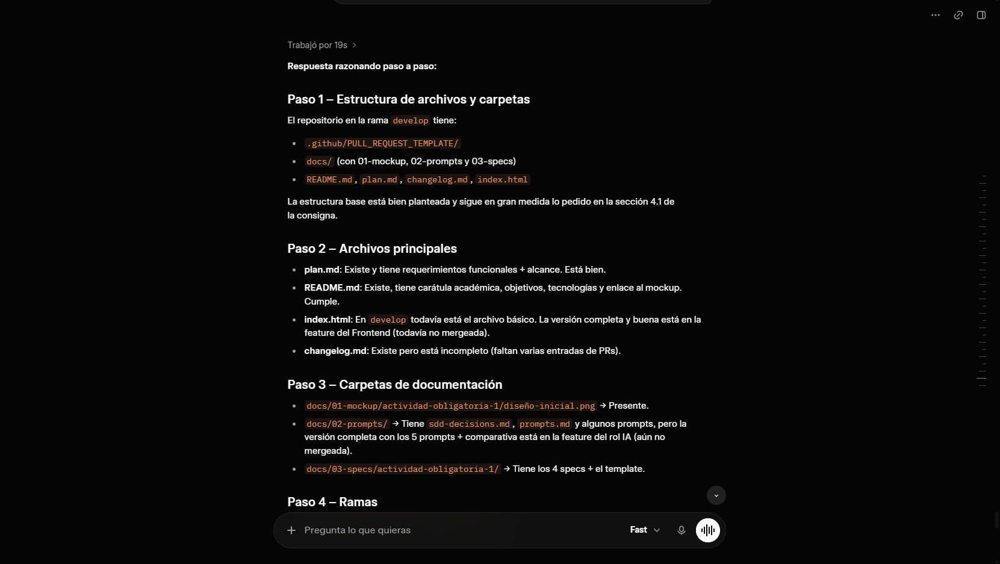
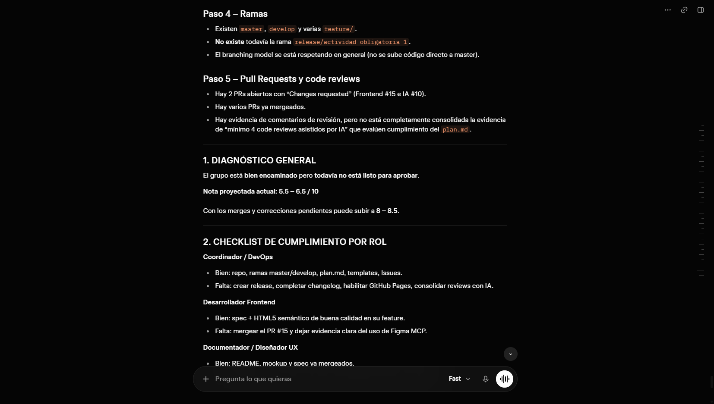
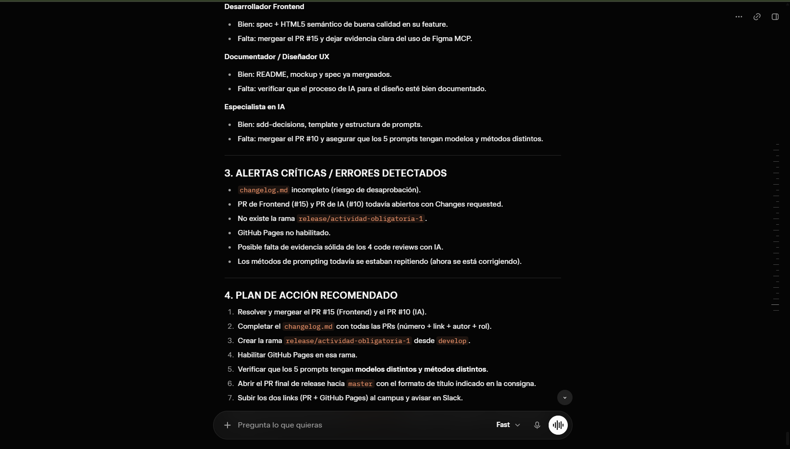

# Prompt 3

**Integrante:** Thiago Piastrellini  
**Rol:** Especialista en IA y Prompt Engineering  
**Modelo de IA:** Grok 4.5  
**Método de prompt:** Chain-of-thought prompting  

## Prompt exacto

**## Prompt exacto**

```text
Actúa como un Senior Software Engineer evaluando el avance del proyecto para la materia "Programación Web I".
Analizá el repositorio: https://github.com/angelgc9107-lgtm/ProyectoFerreteria_GRP05
Quiero que resuelvas esta evaluación razonando paso a paso.
Primero:

Revisá la estructura de archivos y carpetas del repositorio.
Verificá la existencia y calidad de plan.md, README.md, index.html y changelog.md.
Revisá las carpetas docs/01-mockup, docs/02-prompts y docs/03-specs.
Analizá el uso de ramas (master, develop, feature/* y release/*).
Revisá el estado de los Pull Requests y si hay evidencia de code reviews con IA.

Después de razonar paso a paso, respondé con esta estructura:

DIAGNÓSTICO GENERAL (nota proyectada de 1 a 10)
CHECKLIST DE CUMPLIMIENTO POR ROL
ALERTAS CRÍTICAS / ERRORES DETECTADOS
PLAN DE ACCIÓN RECOMENDADO
```

****Captura de pantalla del prompt solicitado:****



## Resultado esperado

Obtener un diagnóstico completo del estado actual del repositorio del proyecto de Ferretería, verificando el cumplimiento de la rúbrica oficial de la Actividad Obligatoria N°1. La respuesta debía identificar el nivel de cumplimiento de cada integrante según su rol, detectar errores o faltantes críticos que pudieran provocar una desaprobación y establecer un plan de acción ordenado para completar la entrega.

## Resultado obtenido

La IA analizó el repositorio y determinó que el proyecto estaba **bien encaminado, pero todavía incompleto para ser aprobado**. Proyectó una calificación de aproximadamente **5,5 a 6,5 sobre 10**, indicando que, con los ajustes pendientes, el grupo podía alcanzar aproximadamente entre **8 y 9 puntos**.

Entre los aspectos positivos, identificó que el repositorio ya contaba con una estructura de carpetas adecuada, las ramas `master` y `develop`, el archivo `plan.md`, los templates de Pull Request, Issues, documentación del mockup, README y las especificaciones correspondientes a los diferentes roles.

También verificó avances específicos de cada integrante:

* **Coordinador / DevOps:** repositorio, ramas, `plan.md`, templates e Issues presentes, aunque faltaba crear la rama `release/actividad-obligatoria-1`, completar el `changelog.md` y habilitar GitHub Pages.
* **Desarrollador Frontend:** rama correspondiente, `spec-frontend.md` e `index.html` con estructura HTML5 y contenido real. Sin embargo, el PR #15 permanecía abierto con *Changes requested* y faltaba consolidar la evidencia del uso de IA.
* **Documentador / Diseñador UX:** PR #9 ya mergeado, README, mockup y `spec-ux.md` presentes. Quedaba verificar y documentar correctamente el proceso de uso de prompts e IA.
* **Especialista en IA y Prompt Engineering:** `sdd-decisions.md`, template de specs y los archivos de prompts estaban presentes en la feature. Sin embargo, el PR #10 continuaba abierto con *Changes requested* y todavía debía verificarse que los cinco prompts utilizaran modelos y métodos diferentes y que contaran con toda la evidencia solicitada.

La IA señaló como principales problemas críticos:

1. `changelog.md` incompleto, especialmente por la falta de enlaces a determinados Pull Requests.
2. PR #15 de Frontend y PR #10 de IA todavía abiertos con *Changes requested*.
3. Ausencia de la rama `release/actividad-obligatoria-1`.
4. Falta de habilitación de GitHub Pages para la rama de release.
5. Posible falta de evidencia suficiente de los cuatro code reviews asistidos por IA.
6. Necesidad de verificar que el profesor figure como colaborador del repositorio.
7. Necesidad de garantizar que los archivos `spec` estén commiteados antes del código correspondiente.

Finalmente, Grok propuso como orden de trabajo: resolver los dos PR pendientes, completar el `changelog.md`, crear la rama `release/actividad-obligatoria-1`, habilitar GitHub Pages, abrir el PR final desde `release/actividad-obligatoria-1` hacia `master` y realizar una revisión final de todos los requisitos de la rúbrica.

****Captura de pantalla del resultado obtenido:****







**## Correcciones manuales realizadas**

* Ninguna sobre el resultado del análisis. Las recomendaciones obtenidas fueron utilizadas como guía para identificar los pendientes del repositorio y organizar las tareas necesarias para completar la Actividad Obligatoria N°1.

**## Aplicación en el proyecto**

Análisis del estado del repositorio y verificación del cumplimiento de la rúbrica de la Actividad Obligatoria N°1. El resultado se utilizó para detectar los faltantes relacionados con los Pull Requests pendientes, `changelog.md`, la rama `release/actividad-obligatoria-1`, GitHub Pages y la documentación/evidencia de los prompts y revisiones asistidas por IA.