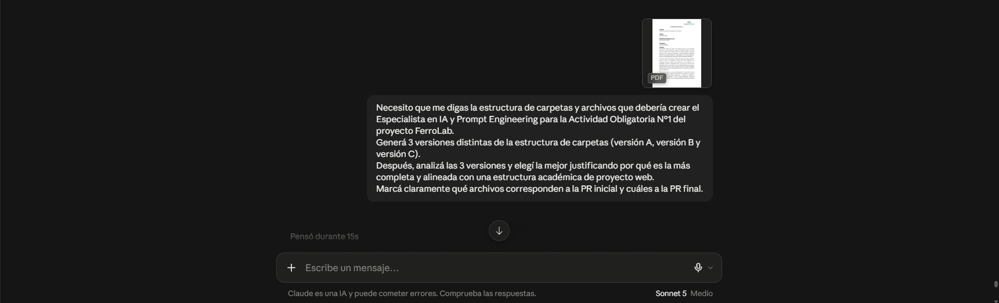
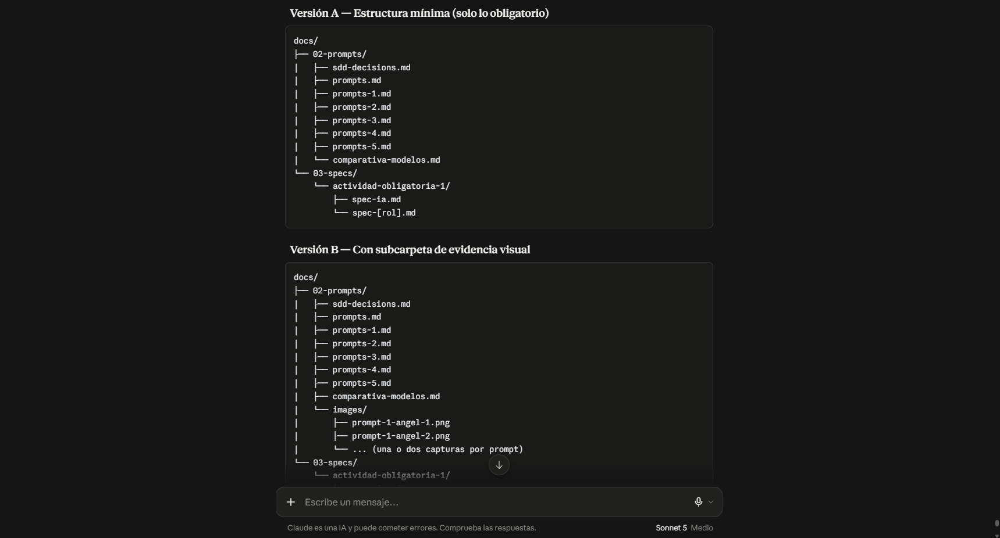
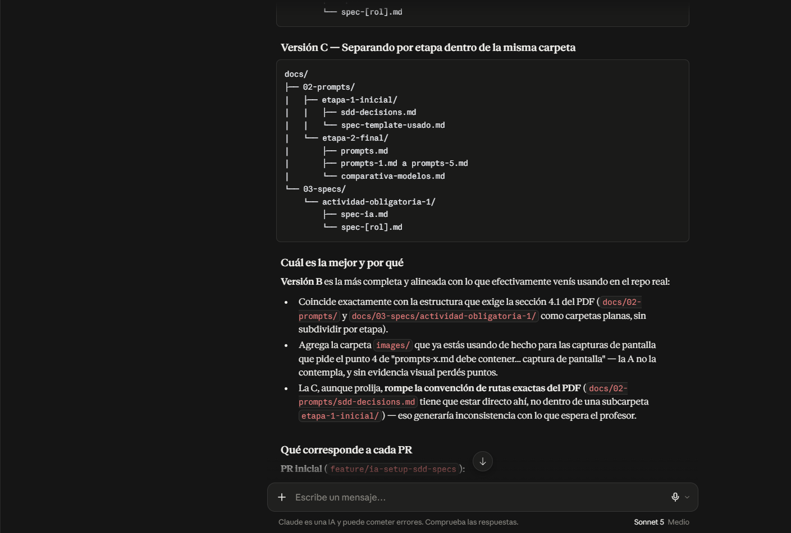
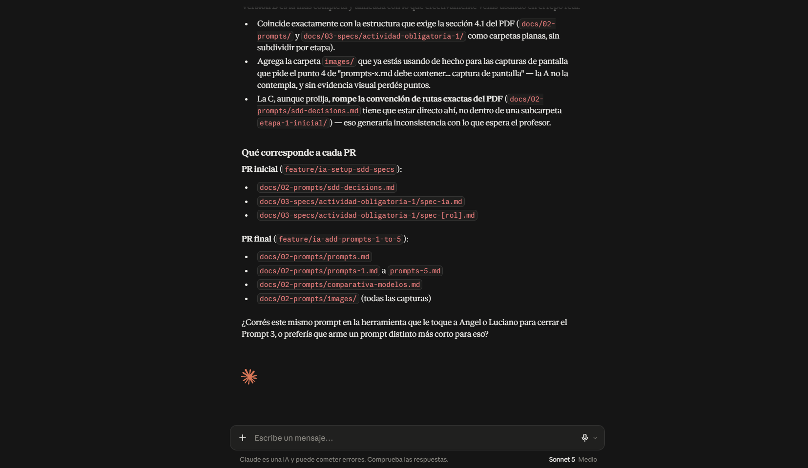

# Prompt 4

**Integrante:** Thiago Piastrellini  
**Rol:** Especialista en IA y Prompt Engineering  
**Modelo de IA:** Claude (Anthropic)  
**Método de prompt:** Self-consistency  

## Prompt exacto
```
Necesito que me digas la estructura de carpetas y archivos que debería crear el Especialista en IA y Prompt Engineering para la Actividad Obligatoria N°1 del proyecto FerroLab.
Generá 3 versiones distintas de la estructura de carpetas (versión A, versión B y versión C).
Después, analizá las 3 versiones y elegí la mejor justificando por qué es la más completa y alineada con una estructura académica de proyecto web.
Marcá claramente qué archivos corresponden a la PR inicial y cuáles a la PR final.
``` 

**Captura de pantalla del prompt solicitado:**  


## Resultado esperado

Obtener tres posibles estructuras de carpetas para el rol de Especialista en IA, una comparación entre ellas y la selección de la versión más completa y alineada con la consigna, identificando claramente qué archivos corresponden a la PR inicial y cuáles a la PR final.

## Resultado obtenido

Claude generó tres versiones distintas de la estructura:

- **Versión A**: Estructura mínima (solo lo obligatorio).
- **Versión B**: Estructura con subcarpeta `images/` para las capturas de pantalla.
- **Versión C**: Estructura separando por etapas (inicial y final) dentro de subcarpetas.

Luego analizó las tres y eligió la **Versión B** como la mejor, justificando que:

- Coincide con las rutas exactas que pide la sección 4.1 del PDF (`docs/02-prompts/` y `docs/03-specs/actividad-obligatoria-1/`).
- Incluye la carpeta `images/` necesaria para las capturas de pantalla que exige la documentación de cada prompt.
- La Versión C rompe las convenciones de rutas exactas del PDF al crear subcarpetas innecesarias.

También detalló qué archivos van en la **PR inicial** (`sdd-decisions.md`, `spec-ia.md` y `spec-[rol].md`) y cuáles en la **PR final** (los 5 `prompts-x.md`, `prompts.md`, `comparativa-modelos.md` y las imágenes).

**Captura de pantalla del resultado obtenido:**  
  
  


## Correcciones manuales realizadas

- Ninguna. Se adoptó la Versión B (con carpeta `images/`) como estructura final para la documentación de prompts.

## Aplicación en el proyecto

Se utilizó la estructura elegida (Versión B) para organizar los archivos del rol Especialista en IA dentro de `docs/02-prompts/` y `docs/03-specs/actividad-obligatoria-1/`, separando correctamente los archivos de la PR inicial y de la PR final.