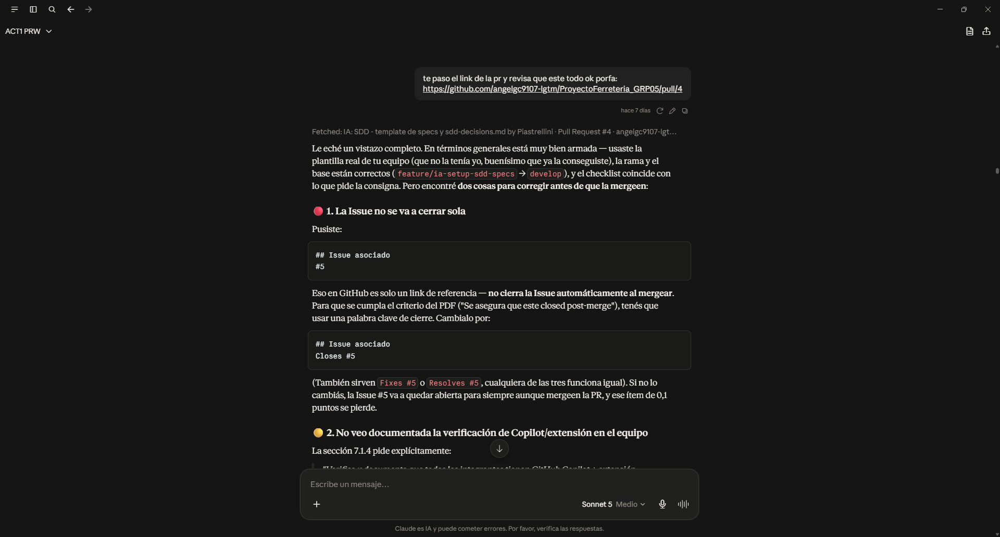
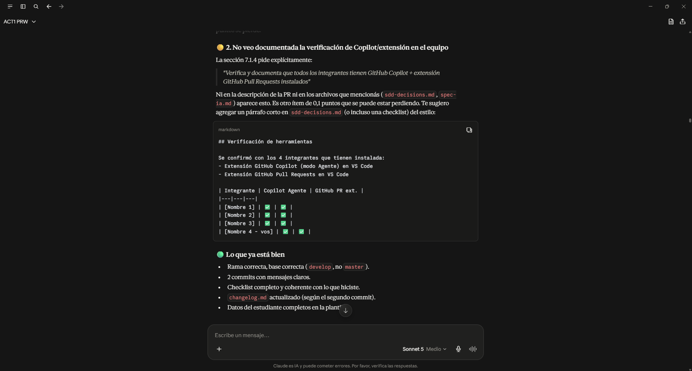

# Prompt 5

**Integrante:** Thiago Piastrellini
**Rol:** Especialista en IA y Prompt Engineering
**Modelo de IA:** Claude (Anthropic)
**Método de prompt:** Role prompting

## Prompt exacto
```
te paso el link de la pr y revisa que este todo ok porfa: https://github.com/angelgc9107-lgtm/ProyectoFerreteria_GRP05/pull/4
```

**Captura de pantalla del prompt solicitado:**


## Resultado esperado

Que la IA actuara como revisora de la Pull Request, accediendo al link real de GitHub, y verificara que la rama base y head fueran correctas, que la plantilla de PR estuviera completa, que el checklist coincidiera con el trabajo realizado, y que la Issue asociada estuviera correctamente vinculada para cerrarse al mergear. Teniendo en cuenta que faltaba la revisión del coordinador. 

## Resultado obtenido

La IA accedió a la PR real en GitHub y detectó dos problemas concretos: la Issue estaba referenciada como "#5" en vez de "Closes #5" (por lo que no se cerraría automáticamente al mergear), y faltaba documentar en `sdd-decisions.md` la verificación de que los 4 integrantes tuvieran instaladas las extensiones de GitHub Copilot y GitHub Pull Requests, tal como lo pide la sección 7.1.4 del PDF de la consigna. También señaló que la PR aún no tenía reviewers asignados.

**Captura de pantalla del resultado obtenido:**



## Correcciones manuales realizadas

- Se corrigió el texto de la Issue asociada en la descripción de la PR, cambiando "#5" por "Closes #5".
- Se agregó la sección "Verificación de herramientas" en `sdd-decisions.md` con la tabla de los 4 integrantes y sus extensiones instaladas.

## Aplicación en el proyecto

Pull Request #4 (`feature/ia-setup-sdd-specs`) y `docs/02-prompts/sdd-decisions.md`.