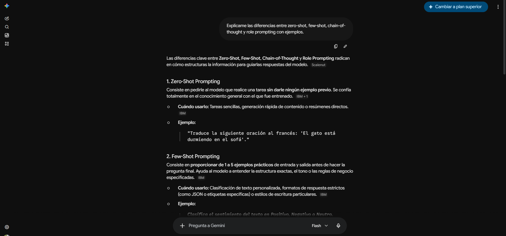
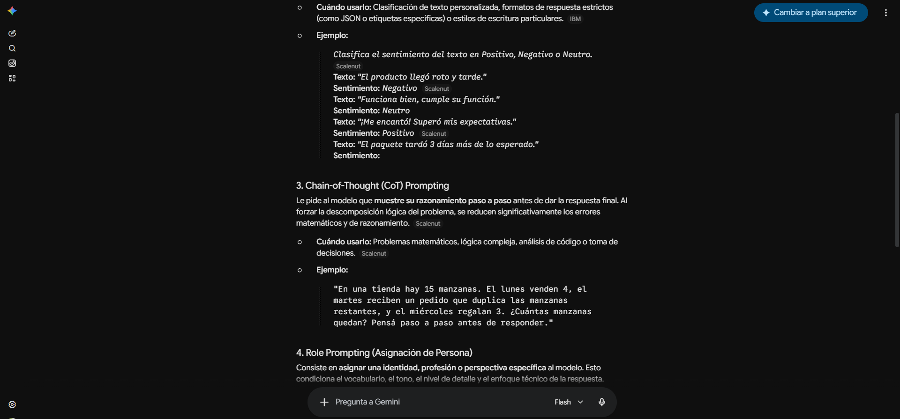
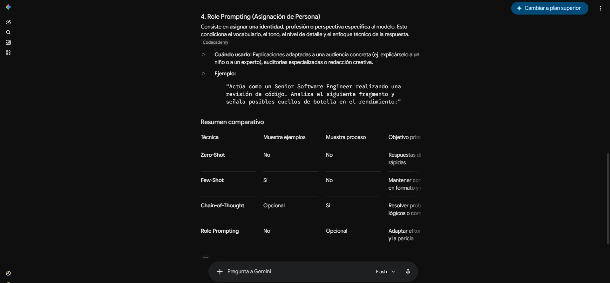

# Prompt 5

**Integrante:** Thiago Piastrellini
**Rol:** Especialista en IA y Prompt Engineering
**Modelo de IA:** Gemini (Google)
**Método de prompt:** Zero-shot prompting

## Prompt exacto
```
Explicame las diferencias entre zero-shot, few-shot, chain-of-thought y role prompting con ejemplos.
```

**Captura de pantalla del prompt solicitado:**


## Resultado esperado

Obtener una explicación clara de las cuatro técnicas de prompting, con ejemplos concretos de cada una y criterios de cuándo usar cada técnica, para poder clasificar correctamente el método usado en cada uno de los 5 prompts documentados por el equipo.

## Resultado obtenido

Gemini explicó las 4 técnicas con definición, cuándo usarlas y un ejemplo concreto de cada una: Zero-shot (sin ejemplos previos, para tareas sencillas), Few-shot (1 a 5 ejemplos de entrada/salida, para formatos estrictos), Chain-of-Thought (razonamiento paso a paso, para problemas lógicos o matemáticos) y Role Prompting (asignar una identidad al modelo, para adaptar tono y nivel técnico). Cerró con una tabla comparativa resumiendo si cada técnica muestra ejemplos, muestra el proceso de razonamiento, y su objetivo principal.

**Captura de pantalla del resultado obtenido:**




## Correcciones manuales realizadas

- Ninguna: el resultado se usó directamente como criterio para clasificar el método de prompting en los 5 archivos `prompts-x.md` del equipo.

## Aplicación en el proyecto

Criterio de clasificación aplicado en `docs/02-prompts/prompts-1.md` a `prompts-5.md`, para determinar qué método de prompting corresponde a cada prompt documentado.