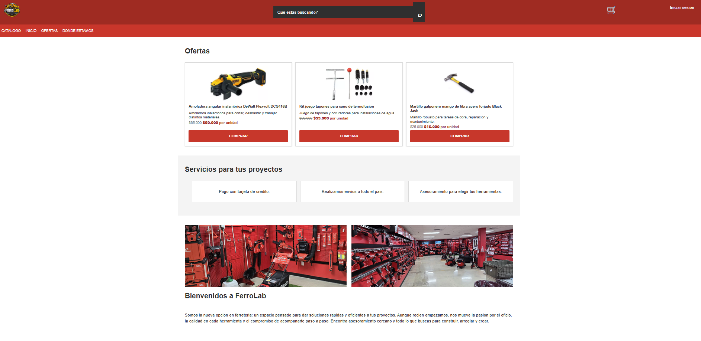
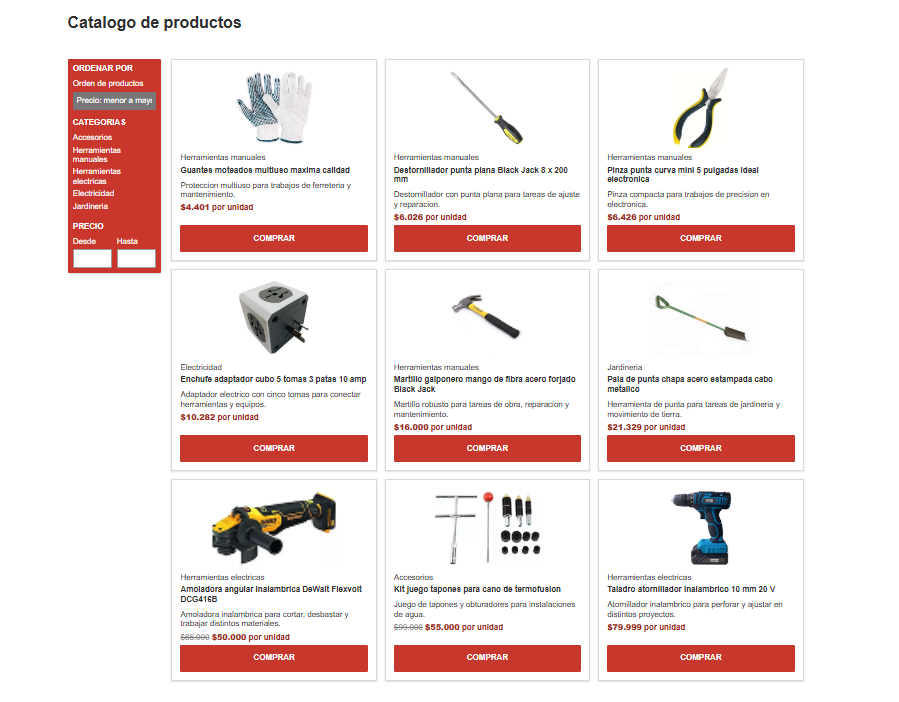
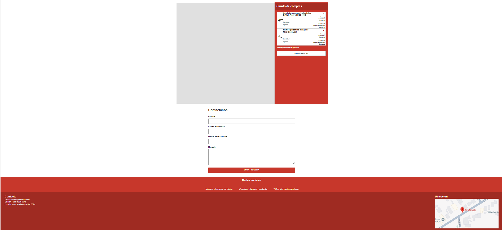

# Spec: Generación de estilos desde mockup actualizado con Figma MCP

**Rol:** Desarrollador Frontend

**Se traza contra:** plan.md — RF1-RF3, RF6-RF8; RNF5-RNF13

**Entrega:** Actividad Obligatoria N°2 — FerroLab

## Qué se va a hacer

Se generarán los estilos visuales de la estructura HTML existente a partir del mockup actualizado por el Coordinador en Figma, utilizando el servidor MCP de Figma junto con GitHub Copilot en modo Agente. El resultado se organizará en `css/styles.css`, para los estilos globales y estructurales, y `css/components.css`, para los componentes reutilizables.

`css/styles.css` contendrá variables CSS en `:root`, reset, tipografías, colores, espaciados, box model y layout base. `css/components.css` contendrá los estilos de botones, cards, navegación, formularios y estados visuales como `hover` y `focus`.

El flujo de trabajo será consultar el mockup mediante Figma MCP, extraer variables, tipografías, colores, espaciados, dimensiones y componentes, generar los estilos, compararlos con el diseño y corregir manualmente las inconsistencias detectadas.

La implementación mantendrá separadas la estructura HTML, la presentación CSS y la futura lógica JavaScript.

## Por qué

Esta tarea incorpora la capa de presentación necesaria para mostrar de forma clara el catálogo, los productos, la navegación, la información comercial y el formulario de contacto de FerroLab.

La correspondencia con `plan.md` es RF1-RF3 y RF6-RF8; también contribuye a la usabilidad, mantenibilidad, legibilidad, separación de responsabilidades, organización de archivos y compatibilidad indicadas en RNF5-RNF13.

La interactividad, JavaScript, cálculos del carrito, validación funcional, procesamiento de pagos y Responsive Design no forman parte del alcance de este rol.

## Criterios de aceptación

- [X] Dado el mockup actualizado, cuando se consulte mediante Figma MCP, entonces se identifican las variables, tipografías, colores, espaciados, dimensiones y componentes necesarios.

- [X] Dado el spec preparado, cuando se cree el primer commit de la actividad, entonces este archivo queda commiteado antes que cualquier archivo CSS.

- [X] Dado el diseño extraído, cuando se genere `css/styles.css`, entonces incluye variables CSS en `:root`, reset, tipografías, colores, box model y layout base.

- [X] Dado el layout base, cuando se definan tamaños y separaciones, entonces `padding`, `margin`, `border`, `box-sizing` y dimensiones relevantes quedan controlados según el box model.

- [X] Dado el conjunto de componentes, cuando se genere `css/components.css`, entonces existen estilos reutilizables para botones, cards, navegación, formularios y estados `hover` y `focus`.

- [X] Dado el HTML existente, cuando se apliquen los estilos, entonces los selectores, herencia y especificidad producen el resultado esperado sin utilizar reglas frágiles o `!important` innecesarios.

- [x] Dado el contenido de la página, cuando se renderice, entonces los elementos de bloque y en línea se diferencian correctamente y el contenido permanece legible y sin solapamientos.

- [x] Dado el código CSS, cuando se revise, entonces mantiene una organización clara y contiene comentarios breves para decisiones de estilo no evidentes.

- [ ] Dado el sitio ejecutado en localhost y GitHub Pages, cuando se realice la comprobación visual, entonces los estilos mantienen las proporciones, colores, tipografías y espaciados definidos en el mockup.

- [ ] Dado el cierre de la actividad, cuando se revise este documento, entonces incluye el prompt utilizado, el resultado obtenido y los ajustes manuales realizados.

## Prompt utilizado para con Copilot para extraer todos los estilos
```
Necesito que te pongas en rol de un especialista de prompt y
generes un prompt limpio para extraer todos los estilos del enlace al servidor
de Figma que esta conectado por MCP, tene en cuenta los siguientes puntos

- Utilizar
     el archivo docs\03-specs\actividad-obligatoria-2\spec-frontend.md para verificar
     las limitaciones que deben tener los archivos generados
- Extraer
     todos los estilos: variables CSS, tipografías, colores, espaciados y componentes.
- Formato
     estructurado
- Archivos
     css/styles.css: variables CSS en :root, reset, tipografías, colores,
     layout base.
- css/components.css:
     botones, cards, navegación, formularios, estados hover/focus.

```

## Resultado obtenido del prompt a copilot para extraer los estilos al Mockup con Figma MCP
```
Analiza el diseño disponible en Figma y la estructura HTML existente del proyecto.

El objetivo es extraer e implementar exclusivamente los estilos correspondientes al rol Desarrollador Frontend.


## Información que debes extraer

Analiza y documenta únicamente los elementos identificables en el FRAME 15 del enlace de Figma: https://www.figma.com/design/jX7NrMUtt6Tg7oiYqock6s/Sin-t%C3%ADtulo?node-id=0-1&t=WQbUPZNRHeUilp9W-1

- Variables y tokens de diseño.
- Variables CSS.
- Familias tipográficas.
- Pesos, tamaños, alturas de línea y espaciado entre letras.
- Colores sólidos, transparencias y gradientes.
- Colores utilizados para estados visuales.
- Espaciados, márgenes, paddings y gaps.
- Anchos, alturas y dimensiones relevantes.
- Bordes, radios, sombras y opacidades.
- Box Model.
- Contenedores, grids y layouts base.
- Componentes visibles.
- Variantes disponibles.
- Estados `default`, `hover`, `focus`, `active`, `disabled`,
  `selected` y `error`, únicamente cuando existan en Figma.

## Archivos que debes generar o actualizar

### `css/styles.css`

Debe contener exclusivamente estilos globales y estructurales.

1. Variables CSS dentro de `:root`, agrupadas por categorías:
   - Colores.
   - Tipografías.
   - Espaciados.
   - Dimensiones.
   - Bordes y radios.
   - Sombras.
   - Layout.

2. Reset CSS.
3. Configuración global de tipografías.
4. Estilos base para `html` y `body`.
5. Box Model global mediante `box-sizing`.
6. Colores globales.
7. Layout base.
8. Contenedores y grids.
9. Utilidades generales estrictamente necesarias.

Controla explícitamente:

- `padding`
- `margin`
- `border`
- `box-sizing`
- `width`
- `height`
- `gap`

### `css/components.css`

Debe contener únicamente estilos correspondientes a componentes reutilizables:

- Botones y sus variantes.
- Cards o tarjetas de productos.
- Navegación.
- Formularios.
- Labels.
- Inputs.
- Selects.
- Textareas.
- Filtros.
- Carrito, únicamente si está presente en el HTML o mockup.
- Otros componentes visibles identificados en Figma.
- Estados `hover`.
- Estados `focus`.
- Estados `active`.
- Estados `disabled`.
- Estados `selected`.
- Estados `error`, únicamente si existen.
- Transiciones coherentes con el diseño.

Todos los estados de foco deben ser visibles y accesibles para navegación mediante teclado.

## Reglas de implementación

- Respeta la estructura HTML existente del repositorio.
- Respeta el diseño definido en Figma.
- Mantén separadas la estructura HTML, la presentación CSS y la futura lógica JavaScript.
- Usa nombres semánticos y consistentes para clases y variables CSS.
- Reutiliza las variables definidas en `:root`.
- Evita duplicar valores globales.
- Aplica correctamente selectores, herencia y especificidad.
- Usa selectores estables y mantén una especificidad controlada.
- No uses `!important`, salvo que exista una justificación técnica explícita.
- Implementa correctamente el Box Model.
- Controla explícitamente `padding`, `margin`, `border` y dimensiones cuando corresponda.
- Diferencia correctamente elementos de bloque y elementos en línea.
- Utiliza Flexbox o CSS Grid cuando sean necesarios para reproducir el layout base del diseño.
- Evita reglas frágiles basadas en posiciones accidentales del DOM.
- Usa CSS moderno, claro, organizado y mantenible.
- Añade comentarios breves únicamente para decisiones de estilo que no sean evidentes.
- Conserva las proporciones, jerarquía visual y espaciados definidos en Figma.
- Mantén la legibilidad y evita solapamientos de contenido.
- No uses estilos inline.
- No agregues JavaScript.
- No modifiques la lógica o funcionalidad existente del HTML.
- No inventes información, componentes, estados o valores que no estén disponibles en Figma o en el proyecto.

## Fuera del alcance del rol
- No implementes Media Queries.
- No definas breakpoints.
- No adaptes componentes específicamente para dispositivos móviles, tablets o diferentes tamaños de pantalla.
- No modifiques el layout en función del ancho o alto del viewport.
- No agregues reglas CSS específicas para resoluciones de pantalla.
```

## Resultado obtenido prompt para Figma MCP

- [components.css](css\components.css)
- [styles.css](css\styles.css)

## Ajustes manuales realizados

- css/styles.css: se ajustó el layout general para mejorar la alineación, distribución y proporción de las distintas secciones respecto del mockup.
- css/styles.css: se corrigió la estructura visual del footer, ajustando la distribución de contacto, redes sociales, ubicación y mapa.
- css/components.css: se corrigieron los colores y la estructura visual del carrito, diferenciando correctamente el encabezado, las tarjetas de productos y el cuerpo del panel.
- css/components.css: se ajustaron padding, márgenes, gap y dimensiones del carrito para obtener una distribución más compacta y similar al mockup.
- css/components.css: se reorganizaron las tarjetas del carrito, mejorando la posición y tamaño de imágenes, descripción, cantidad, precios, subtotales y controles.
- css/components.css: se ajustó el panel de filtros del catálogo para aproximar su color, ancho, tipografía, categorías, selector y campos de precio al diseño de referencia.
- css/components.css: se corrigieron tamaños, alineaciones, bordes y box model de botones, inputs y demás componentes visuales.
- css/components.css: se revisaron los estados hover, focus y disabled para mantener una apariencia coherente con los estados definidos en el mockup.
- css/styles.css y css/components.css: se realizaron correcciones finales de colores, tipografías, espaciados, dimensiones, alineaciones, box model y especificidad detectadas durante la comparación visual con el mockup.
- css/components.css: se corrigió la visualización del selector “Ordenar por”, definiendo explícitamente sus colores para mejorar el contraste y mantener su legibilidad entre navegadores.
- css/components.css: se corrigió el tratamiento del elemento <summary> de la navegación, manteniéndolo como control interactivo y evitando técnicas de ocultación que afecten su accesibilidad.
- css/components.css: se revisaron los selectores basados en posiciones numéricas (nth-of-type) para reemplazarlos, cuando la estructura existente lo permite, por selectores semánticos o estables que no dependan del orden de los elementos.

## Pruebas integradas con Responsive Design & QA Tester

Se realizaron pruebas de integración entre los estilos desarrollados por el Desarrollador Frontend y los estilos implementados por el Especialista en Responsive Design, para validar el funcionamiento en conjunto de ambos desarrollos

## Correcciones solicitadas por QA por el resultado de las pruebas integradas

### QA-TC1 – [Bajo contraste en select "Ordenar por" en WebKit/Safari](https://github.com/angelgc9107-lgtm/ProyectoFerreteria_GRP05/issues/42)

- **Problema detectado:** En WebKit (Safari), el select "Ordenar por" se visualiza con fondo gris claro y texto gris claro, dificultando su lectura y dando la apariencia de estar deshabilitado.

- **Corrección realizada:** Se definieron explícitamente los estilos color y background-color del select, evitando depender del estilo nativo del navegador. Posteriormente, se oscureció el color de fondo a #6b6b6b para mejorar el contraste con el texto blanco y alcanzar el mínimo requerido por WCAG 2.1 AA.

- **Archivo(s) modificado(s):** `css/components.css`

- **Estado:** Corregido.

- **Revalidación QA:** Pendiente.

- **Referencia QA:** Test Case 1 (Compatibilidad desktop) — Momento 1.

- **Rama testeada:** `feature/dev-frontend-css-add-styles`

- **Evidencia:** `docs/04-testing/capturas/tc-1/momento-1/safari-desktop.png`

### QA-TC4 – Bajo contraste en precios tachados del catálogo/ofertas

- **Problema detectado:** axe-core detectó 5 elementos de precio tachado (`<del>`) con texto `#777777` sobre fondo blanco, obteniendo un contraste de 4.47:1, inferior al mínimo de 4.5:1 requerido por WCAG 2.1 AA para texto normal.

- **Corrección realizada:** Se creó la variable `--color-text-secondary` con el valor `#6b6b6b` y se aplicó específicamente a los elementos `article del`, reemplazando el uso de `--color-gray-700`. De esta forma, se oscureció únicamente el texto de los precios tachados sin modificar globalmente `--color-gray-700` ni afectar otros componentes.

- **Archivo(s) modificado(s):** `css/styles.css`, `css/components.css`

- **Estado:** Corregido.

- **Revalidación QA:** Pendiente.

- **Referencia QA:** Test Case 4 (Accesibilidad) — Momento 1.

- **Rama testeada:** `feature/responsive-design-add-responsive-styles`

- **Evidencia:** `docs/04-testing/capturas/tc-4/momento-1/accesibilidad-screenshot.png`


## Pruebas con QA Tester para validar en Github Page
Se realizaron pruebas de integración para validar el correcto funcionamiento del desarrollo en conjunto, utilizando la rama develop y GitHub Pages como entorno de prueba.

## Correcciones solicitadas por QA por el resultado de las pruebas en develop

### QA-TC3 – Imágenes no visibles por diferencia entre mayúsculas y minúsculas

* **Problema detectado:** El archivo `index.html` referencia las imágenes `Bienvenido1.png` y `Bienvenido2.png` con mayúscula inicial, mientras que los archivos versionados en el repositorio se encuentran como `bienvenido1.png` y `bienvenido2.png`. En Windows las imágenes se visualizan correctamente, pero al publicar el sitio en GitHub Pages no se encuentran los archivos debido a la diferencia entre mayúsculas y minúsculas.

* **Corrección realizada:** Pendiente. Se deberá unificar el nombre utilizado en el HTML con el nombre de los archivos del repositorio, utilizando minúsculas para ambas referencias.

* **Archivo(s) modificado(s):** `index.html`

* **Estado:** Pendiente.

* **Revalidación QA:** Pendiente.

* **Referencia QA:** Test Case 3 (Performance) — Momento 2.

* **Rama testeada:** `develop`


## Evidencia de cierre

- **1° Commit 95ee7134e5d1374bf3a1d9c3f669e732a1b7066d [Commit - Comiteando el spec del rol desarrollador frontend](https://github.com/angelgc9107-lgtm/ProyectoFerreteria_GRP05/pull/39/changes/95ee7134e5d1374bf3a1d9c3f669e732a1b7066d)
- **2° Commit b266d408a9d5d9be5f544e6f7769a0d45c2a36b2 [Commit - Agregar Components.css y Styles.css](https://github.com/angelgc9107-lgtm/ProyectoFerreteria_GRP05/pull/39/changes/b266d408a9d5d9be5f544e6f7769a0d45c2a36b2)

- Enlace al archivo Figma utilizado para extraer el components.css & styles.css: [Mockup](https://www.figma.com/design/jX7NrMUtt6Tg7oiYqock6s/Sin-t%C3%ADtulo?node-id=0-1&t=ooNbHAfYrMmAh8i2-1).



- Prueba en GitHub Pages: `[]`.