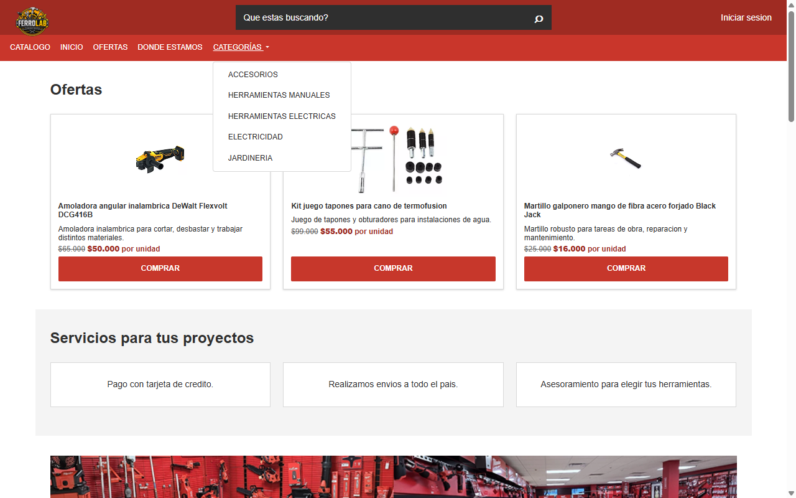
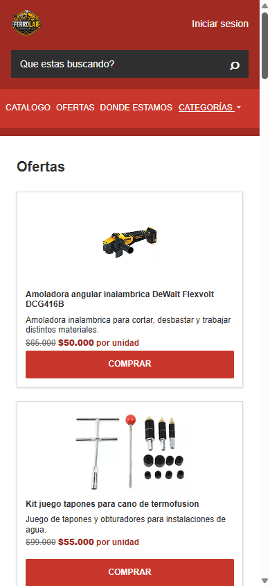
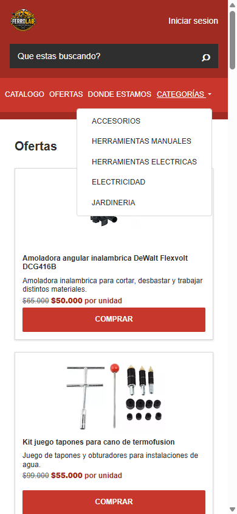
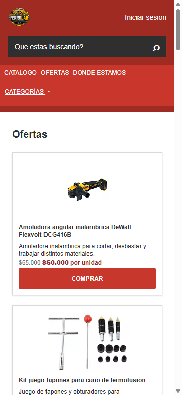
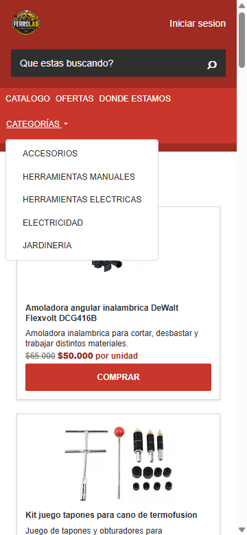
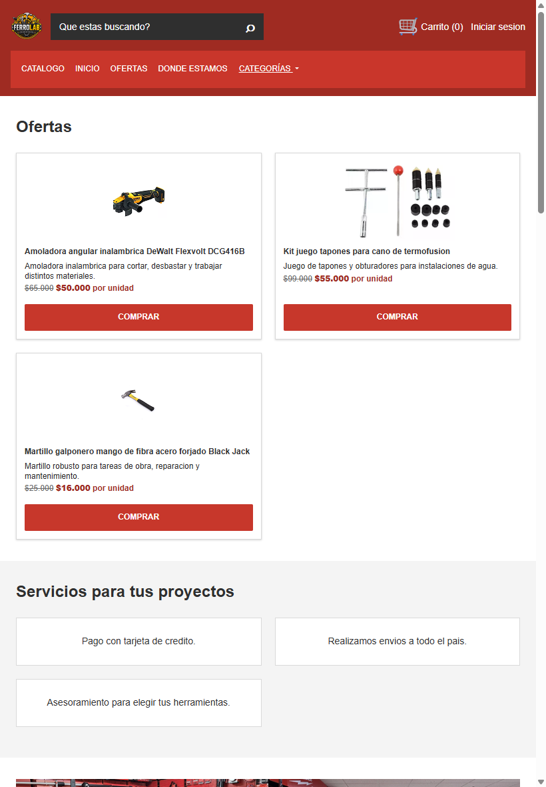
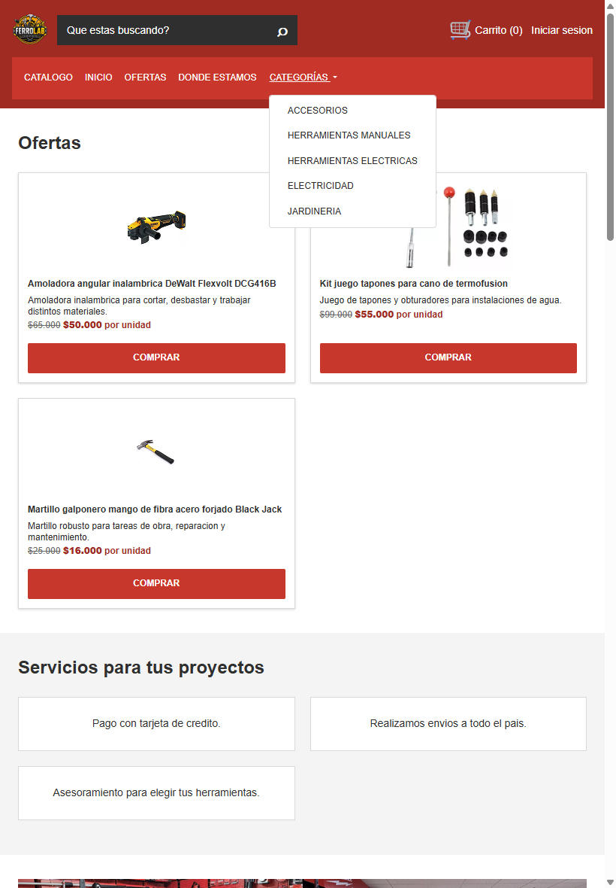

# Test Case 7 — Componente Bootstrap 1

## Metadata

| Campo | Valor |
|-------|-------|
| Responsable | Copilot Agent Mode |
| Fecha de ejecución | 2026-10-07 |
| Rama testeada | `feature/esp-com-bootstrap-add-component` |
| URL testeada | `http://localhost:3000` |

## Componente testeado

| Campo | Descripción |
|-------|-------------|
| **Dropdown** | Dropdown de Categorías |
| **Selector / ID en el HTML** | `#categorias-dropdown` |
| **Sección de la página** | Encabezado — barra de navegación principal |
| **Comportamiento esperado** | Al hacer clic en el botón "Categorías", debe desplegarse un menú con las categorías del catálogo. El menú debe poder abrirse y cerrarse correctamente y mantener los estilos visuales definidos para FerroLab. |

---

## Objetivo
Verificar que el componente Bootstrap implementado funciona correctamente,
responde a las interacciones del usuario, se adapta a distintos viewports
y mantiene la identidad visual definida en bootstrap-overrides.css.

## Herramientas utilizadas
- Playwright MCP (`@playwright/mcp`) con viewport emulation e interacción de UI
- GitHub Copilot Agent Mode
- GitHub MCP (`@modelcontextprotocol/server-github`) para registrar issues

---

## Prompt para Copilot Agent Mode

> **Antes de copiar el prompt:** reemplazá `[COMPONENTE]` con el nombre del componente
> y `[SELECTOR]` con el selector CSS o ID del elemento en el HTML.

```
Usando Playwright MCP, necesito testear el componente Bootstrap [Dropdown de Categorías]
en http://localhost:3000.

Ejecutá estos pasos en orden:

1. Navegá a http://localhost:3000 con viewport 1280x800 (desktop)
   - Localizá el elemento [#categorias-dropdown] en la página
   - Tomá captura del componente en su estado inicial
   - Interactuá con el componente según su tipo:
     · Si es un modal: hacé click en el botón que lo abre y verificá que se abre correctamente
     · Si es un navbar/collapse: hacé click en el toggler y verificá que se despliega
     · Si es un carrusel: avanzá y retrocedé slides, verificá transiciones
     · Si es un accordion: abrí y cerrá secciones, verificá que solo una esté activa
     · Si es un dropdown: hacé click y verificá que el menú aparece correctamente
     · Si es un offcanvas: activá y cerrá, verificá overlay
   - Tomá captura del componente en estado activo/expandido
   - Verificá que los estilos de bootstrap-overrides.css se aplican

2. Cambiá el viewport a 390x844 (iPhone 14 Pro — iOS Safari)
   - Verificá que el componente se adapta correctamente
   - Repetí la interacción
   - Verificá que el menú abre y cierra correctamente
   - Verificá que no exista overflow horizontal
   - Verificá los estados de accesibilidad correspondientes
   - Tomá capturas del estado inicial y abierto
   - Verificá si hay diferencias respecto al desktop

3. Cambiá el viewport a 360x780 (Samsung Galaxy S23 — Chrome Android)
   - Verificá que el componente se adapta correctamente
   - Repetí la interacción
   - Verificá que el menú abre y cierra correctamente
   - Verificá que no exista overflow horizontal
   - Verificá los estados de accesibilidad correspondientes
   - Tomá capturas del estado inicial y abierto
   - Verificá si hay diferencias respecto a los demás dispositivos

4. Cambiá el viewport a 820x1180 (iPad Air — iOS Safari)
   - Verificá el comportamiento del componente en tablet
   - Repetí la interacción
   - Verificá que el menú abre y cierra correctamente
   - Verificá que no exista overflow horizontal
   - Verificá los estados de accesibilidad correspondientes
   - Tomá capturas del estado inicial y abierto
   - Verificá si hay diferencias respecto a los demás dispositivos

5. Para el Dropdown, verificá específicamente en cada viewport:
   - Que #categorias-dropdown sea visible
   - Que al hacer clic se abra el menú
   - Que aparezcan todas las categorías existentes
   - Que los enlaces mantengan sus destinos originales
   - Que aria-expanded cambie correctamente al abrir y cerrar
   - Que Escape cierre el Dropdown
   - Que el foco vuelva correctamente al botón después de cerrarlo con Escape
   - Que no exista overflow horizontal
   - Que los estilos definidos en bootstrap-overrides.css se apliquen

6. Reportá para cada viewport:
   - Nombre del dispositivo
   - Resolución/viewport utilizado
   - Si el componente es visible y funcional
   - Si abre y cierra correctamente
   - Si las animaciones/transiciones funcionan
   - Si la identidad visual se mantiene (colores, tipografías y overrides)
   - Si existe overflow o algún problema responsive
   - Cualquier problema visual, de accesibilidad o de comportamiento

7. No modifiques ningún archivo del proyecto durante las pruebas.
   Solo realizá las pruebas y reportá los resultados obtenidos.

Guardá las capturas en docs/04-testing/capturas/tc-7/
utilizando nombres que permitan identificar el dispositivo y el estado probado.
```

---

## Dispositivos testeados
| Dispositivo / Viewport | Componente visible | Interacción funcional | Estilos override | Estado |
|------------------------|-------------------|----------------------|------------------|--------|
| Desktop — 1280×800 | Sí | Sí — abre con clic y cierra con Escape; el foco vuelve al botón | Sí — tipografía, colores, borde y radio verificados | Aprobado con observación |
| iPhone 14 Pro — 390×844 (viewport emulado) | Sí | Sí — abre con clic y cierra con Escape; el foco vuelve al botón | Sí — tipografía, colores, borde y radio verificados | Aprobado con observación |
| Samsung Galaxy S23 — 360×780 (viewport emulado) | Sí | Sí — abre con clic y cierra con Escape; el foco vuelve al botón | Sí — tipografía y colores verificados | Aprobado con observación |
| iPad Air — 820×1180 (viewport emulado) | Sí | Sí — abre con clic y cierra con Escape; el foco vuelve al botón | Sí — tipografía, colores y borde verificados | Aprobado con observación |

### Resultados observados

- **Selector utilizado:** `#categorias-dropdown`.
- **Desktop (1280×800):** el botón fue visible y abrió el menú con clic; se mostraron las cinco categorías, todas con destino `#catalogo`. El menú abierto midió aproximadamente 223×177 px. Escape lo cerró, `aria-expanded` volvió a `false` y el foco regresó al botón. No se detectó overflow horizontal.
- **iPhone 14 Pro — viewport emulado (390×844):** el botón y las cinco categorías fueron visibles. El menú abrió y cerró con Escape, actualizó `aria-expanded` correctamente y devolvió el foco al botón. No se detectó overflow horizontal; el menú abierto midió aproximadamente 223×177 px y permaneció dentro del ancho útil.
- **Samsung Galaxy S23 — viewport emulado (360×780):** el botón fue visible; el menú abrió con clic, presentó las cinco categorías con destino `#catalogo` y cerró con Escape. `aria-expanded` y el foco se restauraron correctamente. No se detectó overflow horizontal.
- **iPad Air — viewport emulado (820×1180):** el botón fue visible; el menú abrió con clic y presentó las cinco categorías con destino `#catalogo`. Escape cerró el menú, restableció `aria-expanded` y devolvió el foco al botón. No se detectó overflow horizontal.
- **Apertura, cierre y accesibilidad:** en los cuatro viewports Bootstrap cambió `aria-expanded` de `false` a `true` al abrir. Escape cerró el menú (`aria-expanded="false"`) y devolvió el foco a `#categorias-dropdown`.
- **Animaciones/transiciones:** no se observó transición visual durante la apertura ni el cierre. La duración computada fue `0s` en desktop y en el viewport de 390×844.
- **Overrides:** se verificó texto blanco y tipografía FerroLab (`Inter, Arial, Helvetica, sans-serif`) en el botón. En el menú se comprobaron fondo blanco, texto `#2f2f2f`, borde `#d9d9d9` y radio de `4px`.
- **Hallazgo visual:** en los cuatro viewports `--bs-dropdown-box-shadow` tuvo el valor `0 1px 3px rgb(0 0 0 / 16%)`, pero el `box-shadow` efectivo del menú fue `none`.
- **Consola:** no se observaron errores ni warnings relacionados con el Dropdown. Se registró un `404` al solicitar `/favicon.ico`, ajeno al componente.
- **Alcance de dispositivo:** Playwright probó los viewports indicados; no se verificó en dispositivos físicos ni en Safari para iOS o Chrome para Android.

## Capturas de pantalla
| Viewport / Estado | Captura | Estado |
|-------------------|---------|--------|
| Desktop 1280×800 — estado inicial |  | Capturada |
| Desktop 1280×800 — estado abierto |  | Capturada |
| iPhone 14 Pro 390×844 — estado inicial |  | Capturada |
| iPhone 14 Pro 390×844 — estado abierto |  | Capturada |
| Samsung Galaxy S23 360×780 — estado inicial |  | Capturada |
| Samsung Galaxy S23 360×780 — estado abierto |  | Capturada |
| iPad Air 820×1180 — estado inicial |  | Capturada |
| iPad Air 820×1180 — estado abierto |  | Capturada |

## Hallazgos
| # | Viewport | Descripción del problema | Comportamiento esperado | Comportamiento observado | Severidad |
|---|----------|--------------------------|-------------------------|--------------------------|-----------|
| 1 | Todos | La sombra configurada mediante `--bs-dropdown-box-shadow` no se refleja en el menú | Mostrar la sombra FerroLab definida por `--shadow-card` | El valor de la variable está definido, pero el `box-shadow` computado es `none` | Baja |

### Severidad
- **Alta** — Componente no funciona o no se renderiza
- **Media** — Problema visual o de interacción significativo
- **Baja** — Detalle estético menor

## Issues creados
| Issue | Viewport | Descripción | Severidad | Estado |
|-------|----------|-------------|-----------|--------|
| [#91](https://github.com/angelgc9107-lgtm/ProyectoFerreteria_GRP05/issues/91) | Todos | `--bs-dropdown-box-shadow` está configurada, pero el `box-shadow` computado del Dropdown es `none` | Baja | Abierto |

## Conclusión general
**Resultado final:** APROBADO CON OBSERVACIONES

El Dropdown de Categorías fue visible y funcional en los cuatro viewports probados. La apertura, el cierre con Escape, el estado `aria-expanded` y la devolución del foco se comportaron correctamente; no se detectó overflow horizontal y se verificaron los estilos principales de FerroLab. Como observación, el menú no refleja la sombra configurada y no se observó transición de apertura. La consola registró un `404` de `/favicon.ico`, ajeno al componente. Las ocho capturas están guardadas en `docs/04-testing/capturas/tc-7/`.