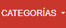
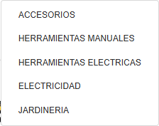
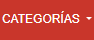
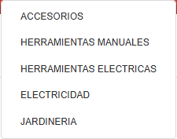
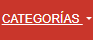
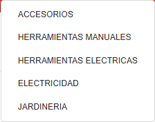

# Test Case 7 — Componente Bootstrap 1

## Metadata

| Campo | Valor |
|-------|-------|
| Responsable | Copilot Agent Mode |
| Fecha de ejecución | 2026-10-06 |
| Rama testeada | `feature/esp-com-bootstrap-add-component` |
| URL testeada | `http://localhost:3000` |

## Componente testeado

| Campo | Descripción |
|-------|-------------|
| **Dropdown** | Dropdown de Categorías |
| **Selector / ID en el HTML** | `#categorias-dropdown` |
| **Sección de la página** | Encabezado — barra de navegación principal |
| **Comportamiento esperado** | Al hacer clic en el botón "Categorías", debe desplegarse un menú con las categorías del catálogo. El menú debe poder abrirse y cerrarse correctamente y mantener los estilos visuales definidos para FerroLab. |

---

## Objetivo
Verificar que el componente Bootstrap implementado funciona correctamente,
responde a las interacciones del usuario, se adapta a distintos viewports
y mantiene la identidad visual definida en bootstrap-overrides.css.

## Herramientas utilizadas
- Playwright MCP (`@playwright/mcp`) con viewport emulation e interacción de UI
- GitHub Copilot Agent Mode
- GitHub MCP (`@modelcontextprotocol/server-github`) para registrar issues

---

## Prompt para Copilot Agent Mode

> **Antes de copiar el prompt:** reemplazá `[COMPONENTE]` con el nombre del componente
> y `[SELECTOR]` con el selector CSS o ID del elemento en el HTML.

```
Usando Playwright MCP, necesito testear el componente Bootstrap [Dropdown de Categorías]
en http://localhost:3000.

Ejecutá estos pasos en orden:

1. Navegá a http://localhost:3000 con viewport 1280x800 (desktop)
   - Localizá el elemento [#categorias-dropdown] en la página
   - Tomá captura del componente en su estado inicial
   - Interactuá con el componente según su tipo:
     · Si es un modal: hacé click en el botón que lo abre y verificá que se abre correctamente
     · Si es un navbar/collapse: hacé click en el toggler y verificá que se despliega
     · Si es un carrusel: avanzá y retrocedé slides, verificá transiciones
     · Si es un accordion: abrí y cerrá secciones, verificá que solo una esté activa
     · Si es un dropdown: hacé click y verificá que el menú aparece correctamente
     · Si es un offcanvas: activá y cerrá, verificá overlay
   - Tomá captura del componente en estado activo/expandido
   - Verificá que los estilos de bootstrap-overrides.css se aplican

2. Cambiá el viewport a 390x844 (iPhone 14 Pro — mobile)
   - Verificá que el componente se adapta correctamente
   - Repetí la interacción y tomá capturas
   - Verificá si hay diferencias respecto al desktop

3. Cambiá el viewport a 768x1024 (iPad — tablet)
   - Verificá comportamiento intermedio
   - Tomá captura

4. Reportá para cada viewport:
   - Si el componente es visible y funcional
   - Si las animaciones/transiciones funcionan
   - Si la identidad visual se mantiene (colores, tipografías de overrides)
   - Cualquier problema visual o de comportamiento

Guardá las capturas en docs/04-testing/capturas/tc-7/
```

---

## Dispositivos testeados
| Viewport | Componente visible | Interacción funcional | Estilos override | Estado |
|----------|-------------------|----------------------|------------------|--------|
| 1280×800 (desktop) | Sí | Sí — abre y cierra con clic | Sí — tipografía y colores verificados | Aprobado con observación |
| 390×844 (mobile) | Sí | Sí — abre con clic y cierra con Escape | Sí — tipografía y colores verificados | Aprobado con observación |
| 768×1024 (tablet) | Sí | Sí — abre con clic y cierra con Escape | Sí — tipografía y colores verificados | Aprobado con observación |

### Resultados observados

- **Selector utilizado:** `#categorias-dropdown`.
- **Desktop (1280×800):** el botón fue localizado y el menú se abrió con clic. Se mostró la lista de cinco categorías, todas con destino `#catalogo`; un segundo clic lo cerró. El menú abierto midió aproximadamente 223×177 px.
- **Mobile (390×844):** el botón y las cinco opciones fueron visibles. El menú abrió con clic, quedó dentro del ancho útil del viewport y no produjo overflow horizontal. Escape lo cerró. El navegador reportó 375 px de ancho útil debido a la barra de desplazamiento.
- **Tablet (768×1024):** el botón fue visible; el menú abrió con clic, mostró las cinco opciones y cerró con Escape. No se observó overflow horizontal. El navegador reportó 753 px de ancho útil debido a la barra de desplazamiento.
- **Apertura y cierre:** Bootstrap actualizó `aria-expanded` de `false` a `true` al abrir. Escape cerró el menú (`aria-expanded="false"`) y devolvió el foco al botón. En desktop también se verificó el cierre haciendo clic de nuevo.
- **Animaciones/transiciones:** el menú se muestra/oculta sin transición; en tablet su `transition-duration` computado fue `0s`. No se observó una animación de apertura.
- **Overrides:** se verificó texto blanco, fondo transparente y tipografía de FerroLab (`Inter, Arial, Helvetica, sans-serif`) en el botón. El menú tuvo fondo blanco, borde `#d9d9d9` y radio de `4px`. Al pasar el cursor sobre “Accesorios”, el fondo cambió a rojo FerroLab (`rgb(199, 55, 43)`) y el texto a blanco.
- **Observación visual:** aunque `--bs-dropdown-box-shadow` computó con el valor `0 1px 3px rgb(0 0 0 / 16%)`, el `box-shadow` efectivo del menú fue `none`.
- **Problema ajeno al componente:** la consola mostró un `404` al solicitar `/favicon.ico`; los recursos de Bootstrap 5.3.8 y los estilos del proyecto respondieron correctamente.
- No se registraron issues durante esta ejecución.

## Capturas de pantalla
| Viewport / Estado | Captura | Estado |
|-------------------|---------|--------|
| Desktop — estado inicial |  | Capturada |
| Desktop — estado abierto |  | Capturada |
| Mobile — estado inicial |  | Capturada |
| Mobile — estado abierto |  | Capturada |
| Tablet — estado inicial |  | Capturada |
| Tablet — estado abierto |  | Capturada |

## Hallazgos
| # | Viewport | Descripción del problema | Comportamiento esperado | Comportamiento observado | Severidad |
|---|----------|--------------------------|-------------------------|--------------------------|-----------|
| 1 | Todos | La sombra configurada mediante `--bs-dropdown-box-shadow` no se refleja en el menú | Mostrar la sombra FerroLab definida por `--shadow-card` | El valor de la variable está definido, pero el `box-shadow` computado es `none` | Baja |

### Severidad
- **Alta** — Componente no funciona o no se renderiza
- **Media** — Problema visual o de interacción significativo
- **Baja** — Detalle estético menor

## Issues creados
| Issue | Viewport | Descripción | Severidad | Estado |
|-------|----------|-------------|-----------|--------|
| [#91](https://github.com/angelgc9107-lgtm/ProyectoFerreteria_GRP05/issues/91) | Todos | `--bs-dropdown-box-shadow` está configurada, pero el `box-shadow` computado del Dropdown es `none` | Baja | Abierto |

## Conclusión general
**Resultado final:** APROBADO CON OBSERVACIONES

El Dropdown de Categorías fue visible y funcional en los tres viewports probados. La apertura, el cierre y el foco al cerrar con Escape se comportaron correctamente, y los estilos principales de identidad FerroLab se verificaron. Como observación, el menú no muestra la sombra configurada y no tiene transición de apertura; además, la consola reportó un 404 de `/favicon.ico`, ajeno al componente. Las seis capturas están guardadas en `docs/04-testing/capturas/tc-7/`.
Mostrando test-case-7.md.