# Test Case 8 — Componente Bootstrap 2

## Metadata

| Campo | Valor |
|-------|-------|
| Responsable | Copilot Agent Mode |
| Fecha de ejecución | 2026-10-06 |
| Rama testeada | `feature/esp-com-bootstrap-add-component` |
| URL testeada | `http://localhost:3000` |

## Componente testeado

| Campo | Descripción |
|-------|-------------|
| **Nombre del componente** | Offcanvas del carrito de compras |
| **Selector / ID en el HTML** | `#carrito` |
| **Sección de la página** | Carrito de compras — panel lateral accesible desde el encabezado |
| **Comportamiento esperado** | Al hacer clic en el botón "Carrito", debe abrirse desde el lateral derecho el Offcanvas con el contenido del carrito. Debe mostrarse el backdrop de Bootstrap y permitir el cierre mediante el botón de cierre, la tecla Escape y los mecanismos oficiales de Bootstrap. El componente debe conservar el contenido y la identidad visual de FerroLab y funcionar correctamente en desktop, tablet y mobile. |

---

## Objetivo
Verificar que el segundo componente Bootstrap implementado funciona correctamente,
responde a las interacciones del usuario, se adapta a distintos viewports
y mantiene la identidad visual definida en bootstrap-overrides.css.

## Herramientas utilizadas
- Playwright MCP (`@playwright/mcp`) con viewport emulation e interacción de UI
- GitHub Copilot Agent Mode
- GitHub MCP (`@modelcontextprotocol/server-github`) para registrar issues

---

## Prompt para Copilot Agent Mode

> **Antes de copiar el prompt:** reemplazá `[COMPONENTE]` con el nombre del componente
> y `[SELECTOR]` con el selector CSS o ID del elemento en el HTML.

```
Usando Playwright MCP, necesito testear el componente Bootstrap [Offcanvas del carrito de compras]
en http://localhost:3000.

Ejecutá estos pasos en orden:

1. Navegá a http://localhost:3000 con viewport 1280x800 (desktop)
   - Localizá el elemento [#carrito] en la página
   - Localizá el botón que abre el carrito
   - Tomá captura del componente en su estado inicial
   - Hacé clic en el botón que abre el carrito
   - Verificá que el Offcanvas se abra correctamente desde la derecha
   - Verificá que aparezca el backdrop/overlay oficial de Bootstrap
   - Tomá captura del componente en estado abierto
   - Verificá que los estilos de bootstrap-overrides.css se aplican
   - Verificá el cierre mediante el botón oficial
   - Volvé a abrirlo y verificá el cierre mediante Escape
   - Verificá que el foco vuelva correctamente al botón que abrió el carrito
   - Volvé a abrirlo y verificá el cierre haciendo clic sobre el backdrop

2. Cambiá el viewport a 390x844 (iPhone 14 Pro — iOS Safari)
   - Verificá que el Offcanvas se adapta correctamente
   - Abrí el carrito mediante su botón
   - Verificá que el panel se muestre correctamente
   - Verificá que el contenido permanezca dentro del panel
   - Verificá que no exista overflow horizontal
   - Verificá que aparezca un único backdrop de Bootstrap
   - Verificá el cierre mediante el botón oficial y Escape
   - Verificá que el foco vuelva correctamente al botón de apertura
   - Tomá capturas del estado inicial y abierto
   - Verificá si hay diferencias respecto al desktop

3. Cambiá el viewport a 360x780 (Samsung Galaxy S23 — Chrome Android)
   - Verificá que el Offcanvas se adapta correctamente
   - Abrí el carrito mediante su botón
   - Verificá que el panel se muestre correctamente
   - Verificá que el contenido permanezca dentro del panel
   - Verificá que no exista overflow horizontal
   - Verificá que aparezca un único backdrop de Bootstrap
   - Verificá el cierre mediante el botón oficial y Escape
   - Verificá que el foco vuelva correctamente al botón de apertura
   - Tomá capturas del estado inicial y abierto
   - Verificá si hay diferencias respecto a los demás dispositivos

4. Cambiá el viewport a 820x1180 (iPad Air — iOS Safari)
   - Verificá el comportamiento del Offcanvas en tablet
   - Abrí el carrito mediante su botón
   - Verificá que el panel se muestre correctamente desde la derecha
   - Verificá que el contenido permanezca dentro del panel
   - Verificá que no exista overflow horizontal
   - Verificá que aparezca un único backdrop de Bootstrap
   - Verificá el cierre mediante el botón oficial y Escape
   - Verificá que el foco vuelva correctamente al botón de apertura
   - Tomá capturas del estado inicial y abierto
   - Verificá si hay diferencias respecto a los demás dispositivos

5. Para el Offcanvas, verificá específicamente en cada viewport:
   - Que el botón del carrito sea visible y funcional
   - Que #carrito se abra correctamente
   - Que el panel se abra desde la derecha
   - Que el contenido existente del carrito permanezca visible
   - Que los productos, cantidades, precios, subtotales y total se visualicen correctamente
   - Que exista un único backdrop/overlay oficial de Bootstrap
   - Que el botón oficial de cierre funcione
   - Que Escape cierre el Offcanvas
   - Que el foco vuelva correctamente al botón de apertura después de cerrarlo con Escape
   - Que el panel pueda cerrarse haciendo clic sobre el backdrop
   - Que no exista overflow horizontal
   - Que los atributos ARIA y estados de accesibilidad correspondientes sean correctos
   - Que los estilos definidos en bootstrap-overrides.css se apliquen
   - Que las dimensiones responsive del Offcanvas se correspondan con las definidas por el proyecto
   - Que la transición de apertura y cierre funcione correctamente

6. Reportá para cada viewport:
   - Nombre del dispositivo
   - Resolución/viewport utilizado
   - Si el componente es visible y funcional
   - Ancho efectivo del Offcanvas cuando está abierto
   - Si abre y cierra correctamente
   - Si funciona el cierre mediante botón, Escape y backdrop
   - Si el foco vuelve correctamente al control de apertura
   - Si existe un único backdrop
   - Si las animaciones/transiciones funcionan
   - Si la identidad visual se mantiene (colores, tipografías y overrides)
   - Si existe overflow o algún problema responsive
   - Cualquier problema visual, de accesibilidad o de comportamiento

7. No modifiques ningún archivo del proyecto durante las pruebas.
   Solo realizá las pruebas y reportá los resultados obtenidos.

Guardá las capturas en docs/04-testing/capturas/tc-8/
utilizando nombres que permitan identificar el dispositivo y el estado probado.
```

---

## Dispositivos testeados
| Viewport | Componente visible | Interacción funcional | Estilos override | Estado |
|----------|-------------------|----------------------|------------------|--------|
| 1280×800 (desktop) | Sí | Sí — abre y cierra | Sí — colores y tipografía verificados | Aprobado con hallazgos |
| 390×844 (iPhone 14 Pro, viewport emulado) | Sí | Sí — abre y cierra con X y Escape; el panel cubre el backdrop | Sí — colores y tipografía verificados | Aprobado con hallazgos |
| 360×780 (Samsung Galaxy S23, viewport emulado) | Sí | Sí — abre y cierra con X y Escape; el panel ocupa todo el viewport | Sí — colores verificados | Aprobado con hallazgos |
| 820×1180 (iPad Air, viewport emulado) | Sí | Sí — abre y cierra | Sí — colores verificados | Aprobado con hallazgos |

### Resultados observados

- **Componente:** Offcanvas del carrito de compras.
- **Selector utilizado:** `#carrito`.
- **Desktop (1280×800):** inicialmente oculto; abrió desde la derecha al activar el botón del carrito. El panel midió 448 px de ancho (35%). Cerró mediante el botón de cierre y también se comprobó Escape en otra interacción.
- **Mobile (390×844):** inicialmente oculto; abrió a ancho completo (390 px). El contenido quedó dentro del panel y no se observó overflow. Cerró mediante el botón de cierre.
- **Tablet (768×1024):** inicialmente oculto; abrió desde la derecha con ancho aproximado de 461 px (60%). No se observó overflow horizontal. Cerró mediante Escape y se verificó la devolución del foco al botón de apertura.
- **Backdrop/overlay:** en los tres viewports Bootstrap creó un único `.offcanvas-backdrop` con opacidad computada `0.5`. Se verificó el cierre al hacer clic en el backdrop en tablet; desaparecieron el panel y el backdrop. También se comprobó que el backdrop desaparece al cerrar mediante botón o Escape.
- **Animaciones/transiciones:** la transición del panel fue `transform 0.3s ease-in-out`; la del backdrop fue `0.15s`.
- **Estilos de `bootstrap-overrides.css`:** se computó el fondo del panel en `rgb(201, 54, 43)`, texto blanco, borde rojo `rgb(199, 55, 43)` y cabecera `rgb(166, 45, 35)`. La tipografía del título fue `Inter, Arial, Helvetica, sans-serif`. Se verificaron los anchos responsivos configurados: 35% desktop, 100% mobile y 60% tablet.
- **Contenido conservado y visible:** dos productos (Amoladora y Martillo), cantidades `1` y `1`, precios unitarios `$50.000` y `$16.000`, subtotales representativos `$50.000` y `$16.000`, resumen de `$66.000` sin envío, `$75.000` con envío y total `$75.000`; también se encontró el botón “Iniciar compra”.
- **Problemas observados:** en la ejecución inicial no se detectaron problemas visuales ni funcionales. Posteriormente, una segunda revisión independiente identificó el hallazgo relacionado con la aplicación de box-shadow, documentado más adelante.

### Segunda revisión independiente — 2026-10-06

Se repitieron las interacciones y comprobaciones de layout y estilos con Playwright MCP. Estos resultados complementan la ejecución inicial y registran hallazgos que no se habían detectado entonces.

- **Desktop (1280×800):** el Offcanvas abrió desde la derecha, con ancho efectivo de 448 px (35%). Cerró con el botón X, Escape y clic en el backdrop. Hubo un único backdrop, que desapareció al cerrar. El foco entró al panel, permaneció dentro al recorrer controles con Tab y volvió al botón de apertura al cerrar. Los elementos revisados quedaron dentro del panel.
- **Mobile (390×844):** abrió desde la derecha a ancho completo (390 px), dejando el backdrop cubierto por el panel. Cerró con X y Escape, pero no con clic físico en el backdrop: al comprobar un punto del borde, `elementFromPoint` identificó `.offcanvas-body`; después del clic el panel siguió abierto y continuó habiendo un backdrop. El foco se mantuvo dentro al usar Tab y volvió al botón con Escape y X. No se detectó overflow horizontal ni desbordamiento de textos revisados.
- **Tablet (768×1024):** abrió desde la derecha, con ancho efectivo aproximado de 461 px (60%). Cerró con X, Escape y clic en el backdrop. Hubo un único backdrop, que desapareció al cerrar. El foco permaneció dentro con Tab y volvió al botón al cerrar; los elementos revisados quedaron dentro del panel y no hubo overflow horizontal.
- **Contenido y controles:** en los tres viewports se encontraron ambos productos, cantidades, precios, subtotales, total y botón de compra; los textos, botones e inputs revisados estaban visibles y dentro del panel.
- **Overflow vertical:** el contenido observado cabía en el área visible (`scrollHeight` igual a `clientHeight` en el panel). El cuerpo conserva `overflow-y: auto`.
- **Estilos computados en los tres viewports:** `--bs-offcanvas-width` fue 35%, 100% y 60%, respectivamente, reflejándose en el ancho efectivo. `--bs-offcanvas-bg: #c9362b` se reflejó como `rgb(201, 54, 43)`; `--bs-offcanvas-color: #ffffff` como texto blanco; `--bs-offcanvas-border-width: 1px` y `--bs-offcanvas-border-color: #c7372b` como borde efectivo `1px solid rgb(199, 55, 43)`. En cambio, aunque `--bs-offcanvas-box-shadow` computó como `0 1px 3px rgb(0 0 0 / 16%)`, el `box-shadow` efectivo fue `none`.
- **Transición:** el panel computó `transform 0.3s ease-in-out`.
- **Conflictos y consola:** no se detectaron backdrops duplicados, elementos del carrito fuera de los límites del panel ni overflow horizontal. No hubo errores o warnings de consola relacionados con el componente. La consola sí registró un 404 de `/favicon.ico`, ajeno al Offcanvas.

### Tercera revisión independiente — 2026-10-07

Se volvió a probar el Offcanvas con Playwright MCP en los cuatro viewports indicados. Los tamaños se emularon en el navegador; no se probaron dispositivos físicos ni Safari para iOS o Chrome para Android. No se modificaron archivos del proyecto durante las pruebas; las únicas salidas generadas fueron las capturas indicadas abajo.

- **Desktop (1280×800):** el botón fue visible y funcional. El panel abrió desde la derecha con ancho efectivo de 448 px (35%), cerró con el botón X, Escape y clic en el backdrop. En cada cierre desapareció el único backdrop y el foco volvió al botón de apertura. No se detectó overflow horizontal.
- **iPhone 14 Pro — viewport emulado (390×844):** el panel abrió desde la derecha y ocupó 390 px (100%). Cerró con X y Escape; en ambos casos desaparecieron panel y backdrop y el foco volvió al botón. Había un solo backdrop, pero el panel cubrió toda su superficie. El intento de clic en el backdrop no pudo alcanzar el overlay: Playwright registró que `.offcanvas-body` interceptaba el evento. No se detectó overflow horizontal ni contenido fuera del panel.
- **Samsung Galaxy S23 — viewport emulado (360×780):** el panel abrió desde la derecha y ocupó 360 px (100%). Cerró con X y Escape, eliminó el único backdrop y devolvió el foco al botón. Al ocupar el panel todo el viewport no quedó área de backdrop expuesta para hacer clic; no se comprobó un cierre físico por backdrop en este tamaño. No se detectó overflow horizontal ni contenido fuera del panel.
- **iPad Air — viewport emulado (820×1180):** el panel abrió desde la derecha con ancho efectivo de 492 px (60%). Cerró con X, Escape y clic en el área expuesta del backdrop; cada cierre eliminó el backdrop y devolvió el foco al botón. No se detectó overflow horizontal ni contenido fuera del panel.
- **Backdrop y accesibilidad:** en los cuatro tamaños se encontró exactamente un `.offcanvas-backdrop` mientras el panel estaba abierto y ninguno después de cerrarlo. Al abrir, Bootstrap aplicó `role="dialog"` y `aria-modal="true"` al panel; `aria-labelledby="titulo-carrito"` identificó el encabezado y el botón disparador conservó `aria-controls="carrito"`. El foco entró al panel; se comprobó que permanece dentro al tabular en tablet. Al cerrarse, Bootstrap retiró `role` y `aria-modal` y devolvió el foco al botón.
- **Contenido y controles:** se verificaron los dos productos (Amoladora y Martillo), cantidades `1` y `1`, precios unitarios de `$50.000` y `$16.000`, subtotales representativos de `$50.000` y `$16.000`, subtotal de `$66.000` sin envío, subtotal de `$75.000` con envío y total de `$75.000`. Inputs y botones estaban visibles; no se detectaron elementos del carrito fuera del panel.
- **Overflow vertical:** el cuerpo del panel admite desplazamiento vertical (`overflow-y: auto`). Los elementos inspeccionados quedaron dentro del panel; no se detectó overflow horizontal en ninguno de los viewports.
- **Estilos computados:** los valores responsive de `--bs-offcanvas-width` (35%, 100%, 100% y 60%, respectivamente) coincidieron con anchos efectivos de 448, 390, 360 y 492 px. El fondo `#c9362b`, el color blanco y el borde `1px solid #c7372b` se reflejaron en los estilos computados. La tipografía observada fue `Inter, Arial, Helvetica, sans-serif`.
- **Sombra:** en los cuatro viewports `--bs-offcanvas-box-shadow` computó como `0 1px 3px rgb(0 0 0 / 16%)`, mientras que el `box-shadow` efectivo permaneció en `none`.
- **Transiciones:** se observaron eventos `transitionrun`, `transitionstart` y `transitionend` en desktop y en los dos viewports mobile probados; la duración computada fue `0.3s` para `transform`. En tablet se verificó la duración computada `0.3s ease-in-out`.
- **Consola:** no se registraron errores ni warnings relacionados con el Offcanvas. Se observó un `404` de `/favicon.ico`, ajeno al componente.

## Capturas de pantalla
| Viewport / Estado | Captura | Estado |
|-------------------|---------|--------|
| Desktop — estado inicial | 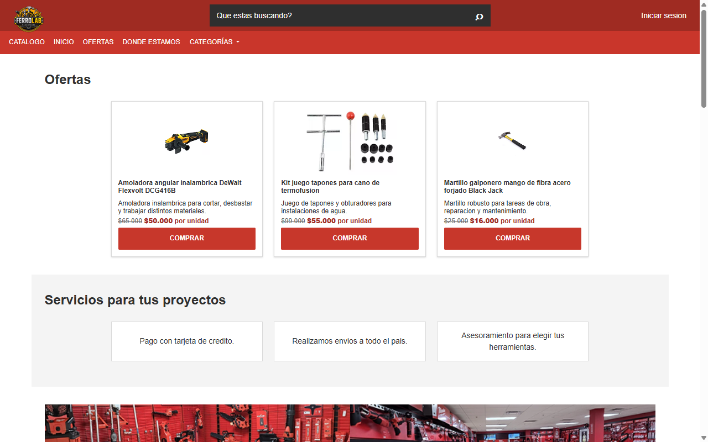 | Capturada |
| Desktop — estado abierto | 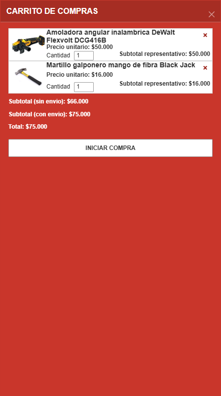 | Capturada |
| Desktop — backdrop visible | 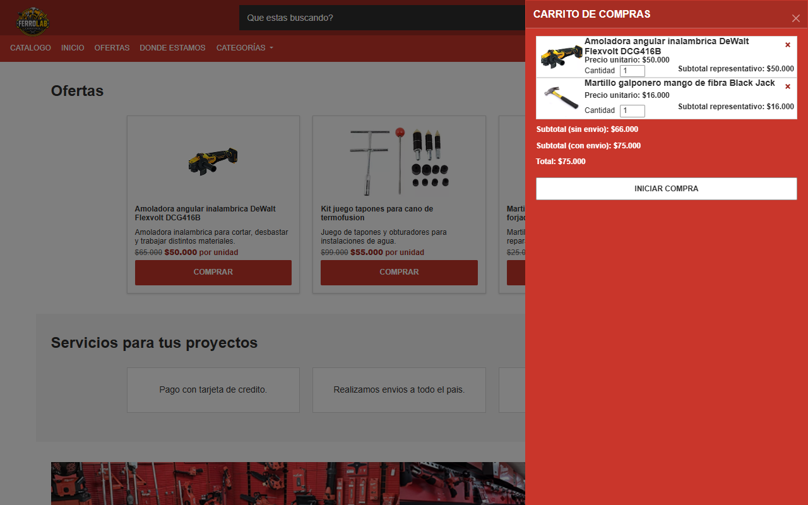 | Capturada |
| Tablet — estado inicial | 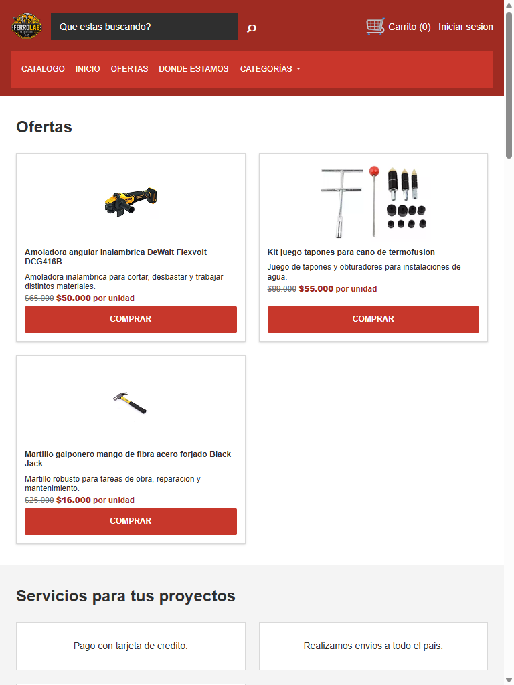 | Capturada |
| Tablet — estado abierto | 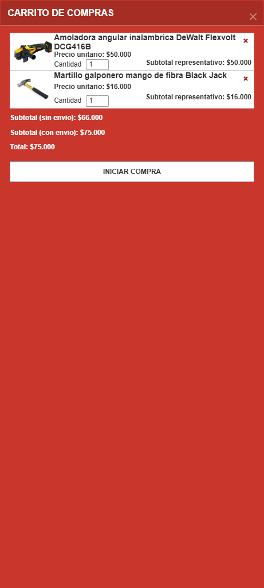 | Capturada |
| Tablet — backdrop visible | 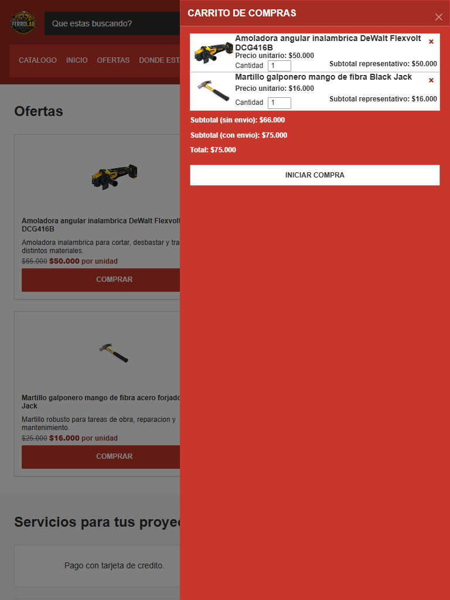 | Capturada |
| Revisión 2026-10-07 — Desktop 1280×800 — estado inicial | 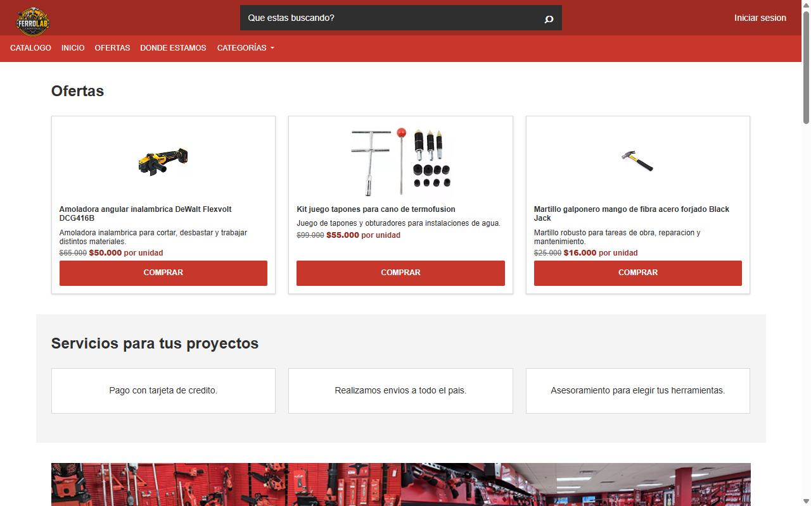 | Capturada |
| Revisión 2026-10-07 — Desktop 1280×800 — estado abierto |  | Capturada |
| Revisión 2026-10-07 — iPhone 14 Pro 390×844 — estado inicial | 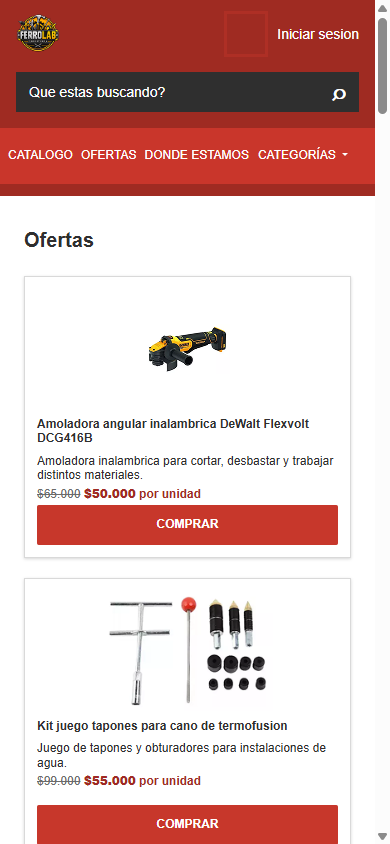 | Capturada |
| Revisión 2026-10-07 — iPhone 14 Pro 390×844 — estado abierto | 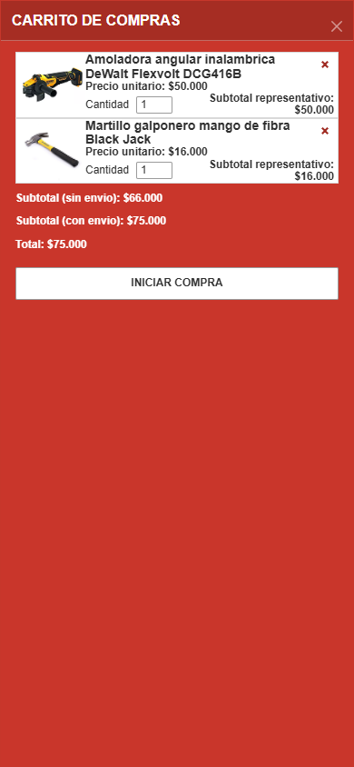 | Capturada |
| Revisión 2026-10-07 — Galaxy S23 360×780 — estado inicial | 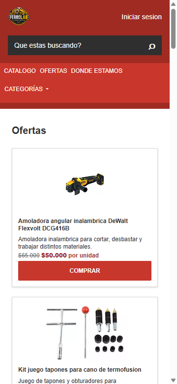 | Capturada |
| Revisión 2026-10-07 — Galaxy S23 360×780 — estado abierto |  | Capturada |
| Revisión 2026-10-07 — iPad Air 820×1180 — estado inicial | 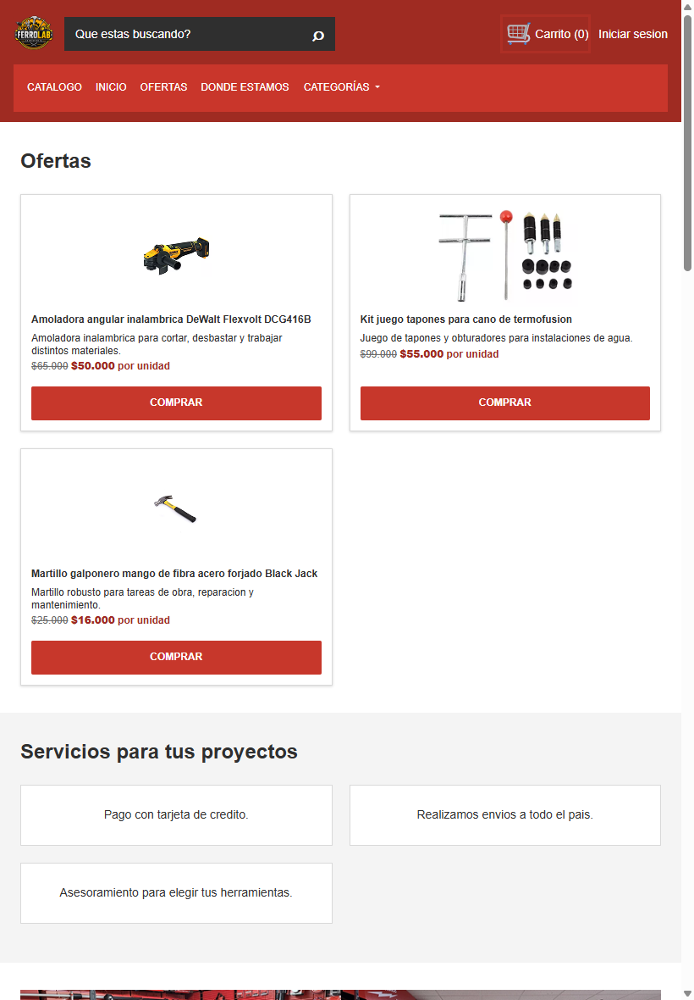 | Capturada |
| Revisión 2026-10-07 — iPad Air 820×1180 — estado abierto | 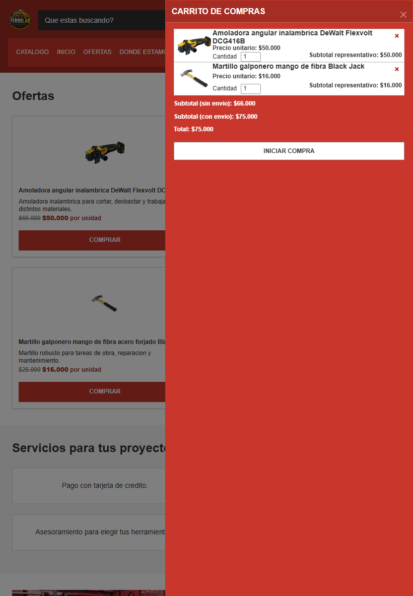 | Capturada |

## Hallazgos
| # | Viewport | Descripción del problema | Comportamiento esperado | Comportamiento observado | Severidad |
|---|----------|--------------------------|-------------------------|--------------------------|-----------|
| 1 | Desktop, mobile y tablet (1280×800, 390×844, 360×780 y 820×1180) | La sombra configurada no se aplica al panel | El valor de `--bs-offcanvas-box-shadow` debe reflejarse en el `box-shadow` efectivo | La variable computada es `0 1px 3px rgb(0 0 0 / 16%)`, pero `box-shadow` computa como `none` en los cuatro viewports | Baja |

### Severidad
- **Alta** — Componente no funciona o no se renderiza
- **Media** — Problema visual o de interacción significativo
- **Baja** — Detalle estético menor

## Issues creados
| Issue | Viewport | Descripción | Severidad | Estado |
|-------|----------|-------------|-----------|--------|
| [#97](https://github.com/angelgc9107-lgtm/ProyectoFerreteria_GRP05/issues/97)| Desktop, mobile y tablet | `--bs-offcanvas-box-shadow` está definida, pero `box-shadow` efectivo es `none` | Baja | Corregido |

## Retest del fix — Issue #97 — 2026-10-07

Se repitió la comprobación con Playwright MCP, consultando `getComputedStyle(#carrito)` con el Offcanvas abierto en cada viewport. Antes de abrirlo en desktop, `--bs-offcanvas-box-shadow` computó como `0 1px 3px rgb(0 0 0 / 16%)` y `box-shadow` efectivo como `rgba(0, 0, 0, 0.16) 0px 1px 3px 0px` (el panel todavía estaba oculto). El panel usa las clases `offcanvas offcanvas-end` de Bootstrap.

| Dispositivo / viewport | `--bs-offcanvas-box-shadow` | `box-shadow` computado con panel abierto | ¿Es `none`? | Visible / sin overflow horizontal | Resultado |
|------------------------|-----------------------------|------------------------------------------|-------------|-----------------------------------|-----------|
| Desktop — 1280×800 | `0 1px 3px rgb(0 0 0 / 16%)` | `rgba(0, 0, 0, 0.16) 0px 1px 3px 0px` | No | Sí / Sí | PASS |
| iPhone 14 Pro — 390×844 (viewport emulado) | `0 1px 3px rgb(0 0 0 / 16%)` | `rgba(0, 0, 0, 0.16) 0px 1px 3px 0px` | No | Sí / Sí | PASS |
| Samsung Galaxy S23 — 360×780 (viewport emulado) | `0 1px 3px rgb(0 0 0 / 16%)` | `rgba(0, 0, 0, 0.16) 0px 1px 3px 0px` | No | Sí / Sí | PASS |
| iPad Air — 820×1180 (viewport emulado) | `0 1px 3px rgb(0 0 0 / 16%)` | `rgba(0, 0, 0, 0.16) 0px 1px 3px 0px` | No | Sí / Sí | PASS |

En todos los tamaños, el valor efectivo de `box-shadow` coincide con la sombra declarada por `bootstrap-overrides.css`; por lo tanto, la variable no está meramente declarada: se aplica al panel. La inspección visual confirmó el Offcanvas abierto y no se observaron regresiones responsive relacionadas con la sombra. En móvil el panel ocupa todo el ancho, por lo que su sombra perimetral es menos distinguible visualmente; el estilo computado sigue siendo el mismo.

**Solución aplicada:** El retest confirma que el fix está presente y corrige el comportamiento reportado. **Resultado del retest: PASS — Issue #97 corregida.** Esta verificación no actualiza el estado de la Issue en GitHub.

### Capturas del retest
| Dispositivo / estado | Captura |
|----------------------|---------|
| Desktop 1280×800 — Offcanvas abierto | 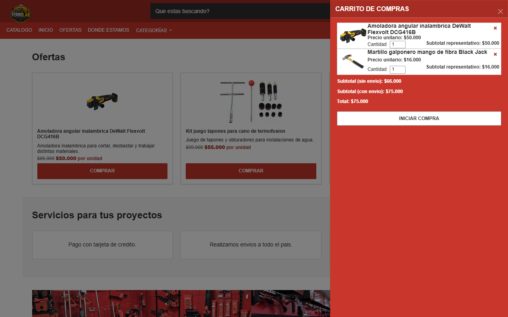 |
| iPhone 14 Pro 390×844 — Offcanvas abierto |  |
| Samsung Galaxy S23 360×780 — Offcanvas abierto | 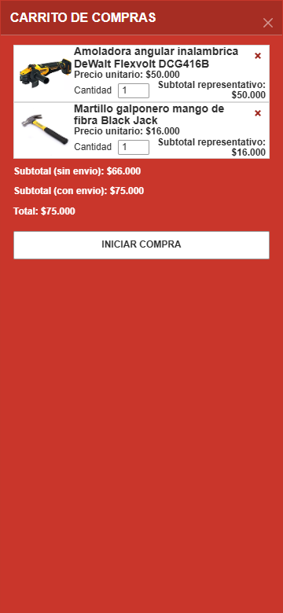 |
| iPad Air 820×1180 — Offcanvas abierto | 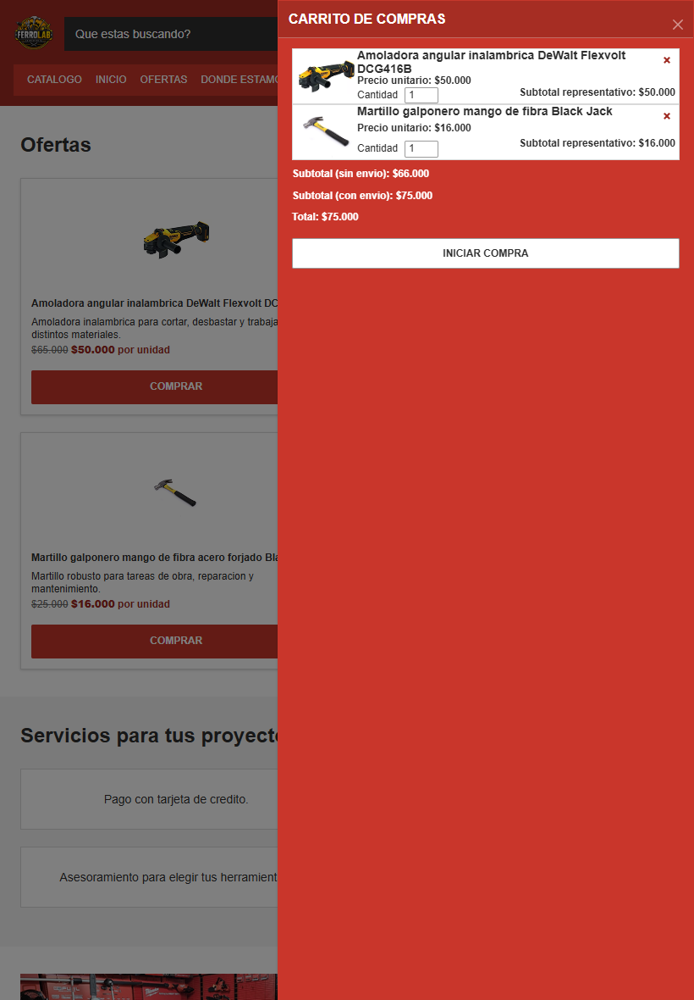 |

## Conclusión general
**Resultado final:** APROBADO — HALLAZGO HISTÓRICO CORREGIDO

El Offcanvas abrió correctamente en los cuatro viewports emulados. El cierre con X y Escape, la gestión del foco, las dimensiones responsive y las transiciones se verificaron; el cierre mediante clic en el backdrop funcionó donde quedó área expuesta (desktop y tablet). El hallazgo histórico de severidad baja sobre la sombra se corrigió: el retest del 2026-10-07 verificó que el `box-shadow` efectivo ya no es `none` en ninguno de los cuatro viewports.